# Hướng dẫn cài đặt QuanLyHoSo 1.0.0

QuanLyHoSo gồm hai bộ cài dành cho Windows 64-bit:

- `QuanLyHoSo-Server-Setup-1.0.0-win-x64.exe`: cài trên một máy được chọn làm Server.
- `QuanLyHoSo-Client-Setup-1.0.0-win-x64.exe`: cài trên các máy trạm sử dụng phần mềm.

Nên cài và khởi động Server trước khi cài Client.

## 1. Cài máy Server

1. Chép `QuanLyHoSo-Server-Setup-1.0.0-win-x64.exe` vào máy được chọn làm Server.
2. Nhấp đúp bộ cài và đồng ý yêu cầu quyền Administrator của Windows.
3. Tại màn hình **Select Destination Location**, giữ thư mục mặc định hoặc chọn **Browse...** để đổi thư mục cài đặt, sau đó chọn **Next**.

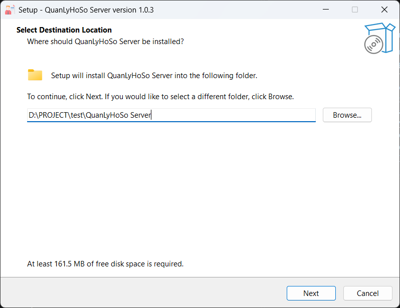

4. Tại màn hình **Select Additional Tasks**:
   - Chọn **Create a desktop shortcut** nếu muốn tạo biểu tượng ngoài màn hình.
   - Nên chọn **Start QuanLyHoSo Server when I sign in to Windows** để Server tự khởi động khi đăng nhập Windows.
   - Chọn **Next**.

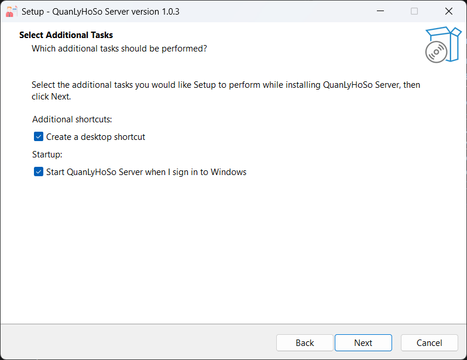

5. Kiểm tra lại thông tin tại màn hình **Ready to Install**, rồi chọn **Install**.

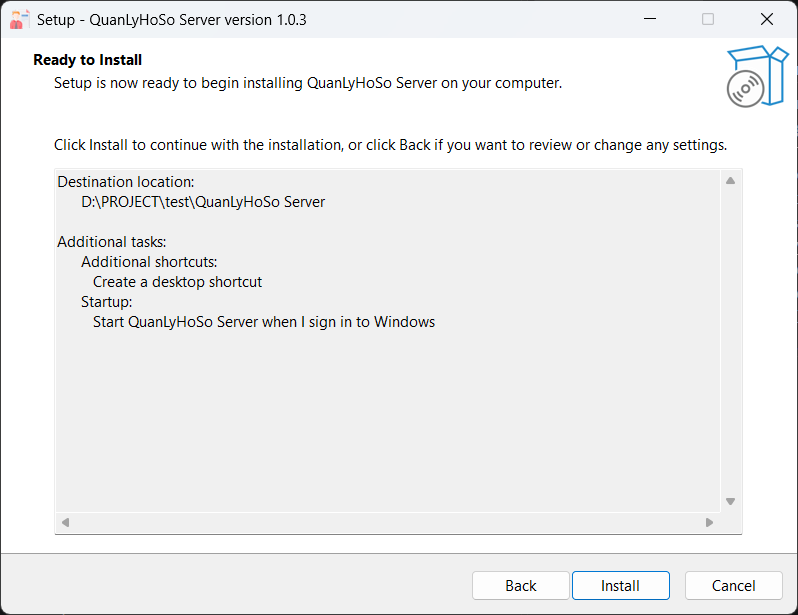

6. Chờ bộ cài hoàn tất việc sao chép file và cấu hình kết nối mạng.

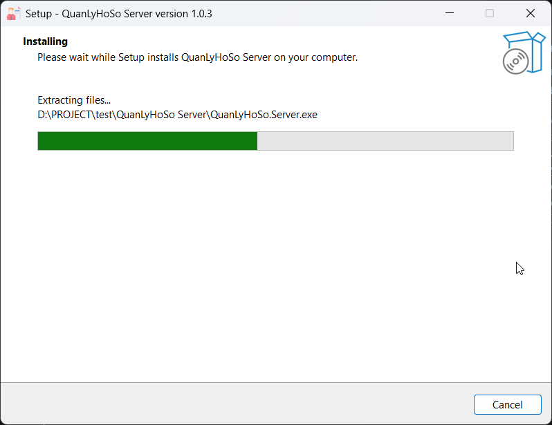

7. Tại màn hình hoàn tất, giữ chọn **Launch QuanLyHoSo Server** và chọn **Finish**.

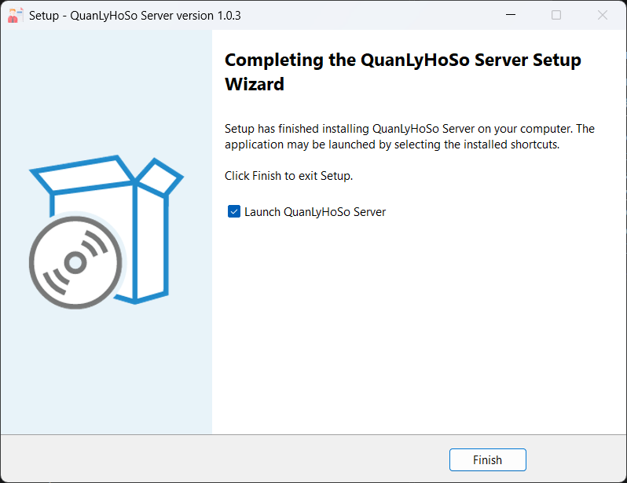

8. Trên bảng điều khiển Server, kiểm tra trạng thái **Đang hoạt động** và ghi lại **Địa chỉ kết nối**, ví dụ `http://SERVER-PC:5055` hoặc `http://192.168.1.10:5055`. Dùng nút sao chép bên cạnh địa chỉ để tránh nhập sai khi cài Client.

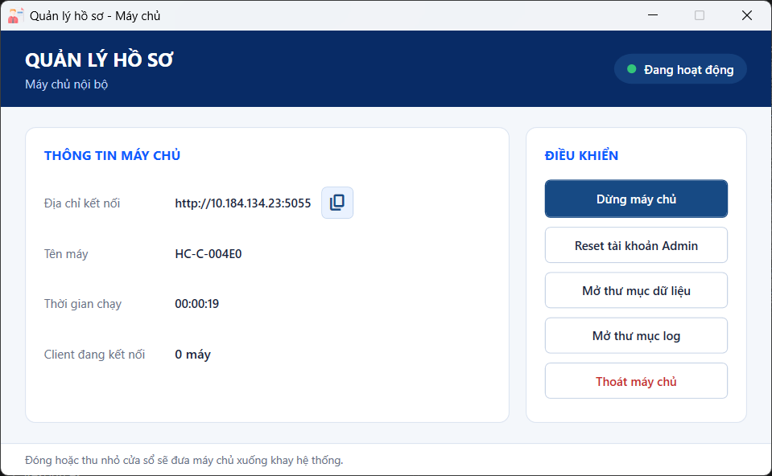

Giữ Server chạy trong thời gian các máy Client sử dụng phần mềm. Có thể đóng hoặc thu nhỏ cửa sổ để đưa Server xuống khay hệ thống; chỉ nút **Thoát máy chủ** mới dừng hoàn toàn Server.

Bộ cài Server tự đăng ký URL và mở cổng TCP `5055` cho các thiết bị trong cùng mạng LAN. Dữ liệu chính được lưu tại:

```text
C:\ProgramData\QuanLyHoSo\Data\quanlyhoso.db
```

Ở lần cài mới, hệ thống tạo database trống, các danh mục mặc định và tài khoản quản trị `admin` với mật khẩu ban đầu `admin123`. Hệ thống không tạo hồ sơ minh họa trong database của khách hàng. Người dùng phải đổi mật khẩu quản trị sau lần đăng nhập đầu tiên.

## 2. Cài từng máy Client

1. Đảm bảo máy Client cùng mạng LAN với máy Server và Server đang ở trạng thái **Đang hoạt động**.
2. Chép và chạy `QuanLyHoSo-Client-Setup-1.0.0-win-x64.exe`.
3. Tại màn hình **Select Destination Location**, giữ thư mục mặc định hoặc chọn **Browse...** để đổi thư mục cài đặt, sau đó chọn **Next**.

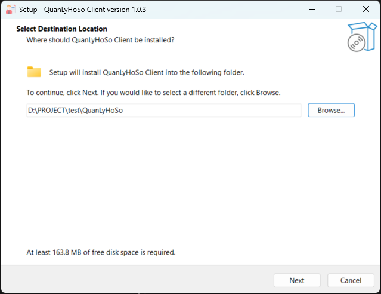

4. Tại màn hình **Server connection**, nhập đúng **Địa chỉ kết nối** đã lấy từ bảng điều khiển Server vào ô **Server address**, rồi chọn **Next**.

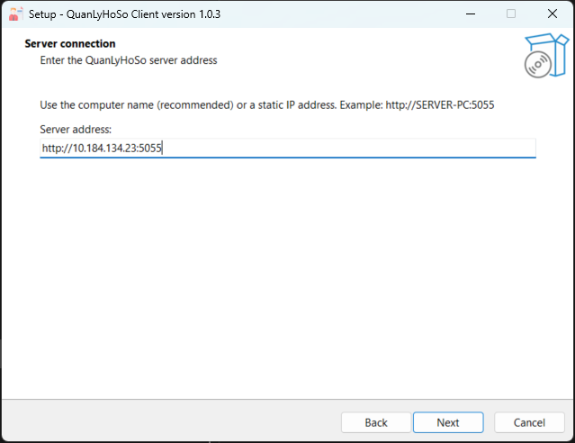

Bộ cài sẽ thử kết nối tới Server. Nếu xuất hiện cảnh báo không kết nối được, kiểm tra lại:

- Server đang chạy.
- Hai máy đang ở cùng mạng LAN.
- Địa chỉ máy hoặc địa chỉ IP đã nhập đúng.
- Cổng `5055` không bị thiết bị mạng hoặc phần mềm bảo mật chặn.

Ví dụ URL hợp lệ:

```text
http://SERVER-PC:5055
http://192.168.1.10:5055
```

Không nhập `http://0.0.0.0:5055` trên Client. Địa chỉ `0.0.0.0` chỉ được Server dùng để lắng nghe kết nối.

5. Tại màn hình **Select Additional Tasks**, chọn **Create a desktop shortcut** nếu muốn tạo biểu tượng ngoài màn hình, rồi chọn **Next**.

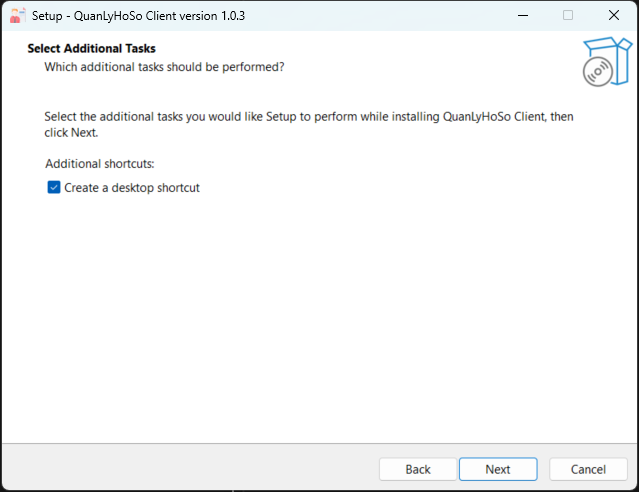

6. Kiểm tra lại thông tin tại màn hình **Ready to Install**, rồi chọn **Install**.

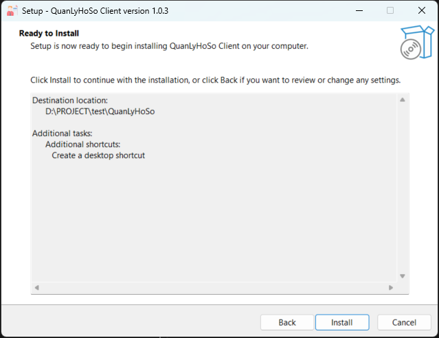

7. Chờ bộ cài hoàn tất việc sao chép file.

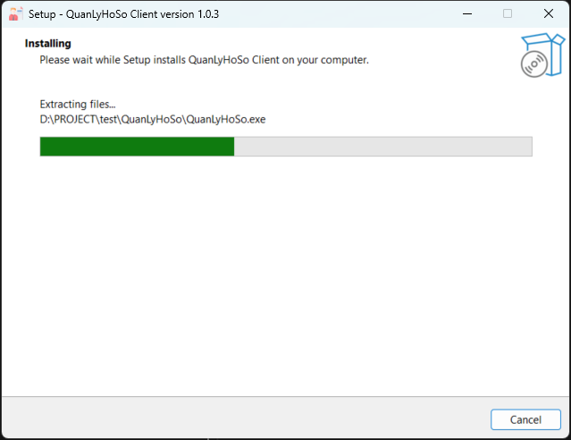

8. Tại màn hình hoàn tất, giữ chọn **Launch QuanLyHoSo Client** và chọn **Finish** để mở phần mềm.

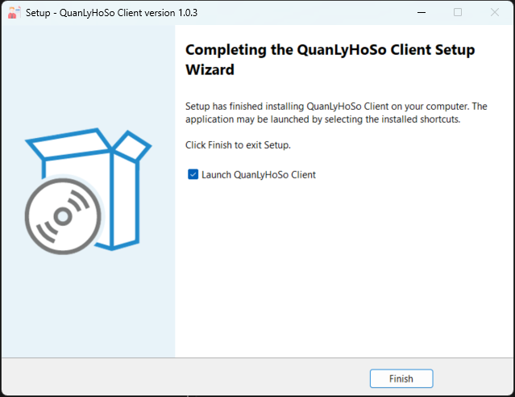

## 3. Cài Client tự động

Có thể truyền URL của Server bằng tham số khi cài đặt tự động hoặc theo kịch bản:

```powershell
.\QuanLyHoSo-Client-Setup-1.0.0-win-x64.exe /SERVERURL="http://SERVER-PC:5055"
```

## 4. Đồng bộ phiên bản Server và Client

Server và tất cả máy Client phải sử dụng cùng một phiên bản phát hành. Mỗi Client gửi số phiên bản khi kết nối; Server kiểm tra trước khi cho phép đăng nhập và sử dụng API nghiệp vụ.

Nếu phiên bản không khớp, Client sẽ hiển thị thông báo không tương thích và yêu cầu cài đúng phiên bản đang chạy trên Server. Cơ chế này ngăn Client cũ gửi dữ liệu theo cấu trúc hoặc quy trình nghiệp vụ đã thay đổi.

Khi triển khai bản mới:

1. Thông báo thời gian bảo trì và yêu cầu người dùng đóng ứng dụng Client.
2. Sao lưu dữ liệu trên Server.
3. Cập nhật Server lên phiên bản mới.
4. Cập nhật toàn bộ Client bằng bộ cài có cùng số phiên bản.
5. Mở lại Client, đăng nhập và kiểm tra các chức năng chính.

Không nên tiếp tục vận hành thường xuyên khi Server và Client khác phiên bản. Việc kiểm tra kết nối trong bộ cài Client cũng xác nhận Server đang chạy phiên bản tương thích.

## 5. Lưu ý

- Hai bộ cài chỉ dành cho Windows 64-bit.
- Client không yêu cầu quyền Administrator.
- Server yêu cầu quyền Administrator khi cài hoặc gỡ để cấu hình URL và Windows Firewall.
- Hai ứng dụng đã kèm .NET Runtime; máy đích không cần cài .NET riêng.
- Bộ cài chưa có chữ ký số của nhà phát hành nên Windows SmartScreen có thể hiển thị cảnh báo **Unknown publisher**. Chỉ tiếp tục nếu file được nhận từ nguồn bàn giao tin cậy và mã SHA-256 khớp với file `SHA256.txt` đi kèm bản phát hành.
