# Hướng dẫn cài đặt QuanLyHoSo 1.0.0

QuanLyHoSo gồm hai bộ cài dành cho Windows 64-bit:

- `QuanLyHoSo-Server-Setup-1.0.0-win-x64.exe`: cài trên một máy được chọn làm Server.
- `QuanLyHoSo-Client-Setup-1.0.0-win-x64.exe`: cài trên các máy trạm sử dụng phần mềm.

Nên cài và khởi động Server trước khi cài Client.

## 1. Cài máy Server

1. Chép `QuanLyHoSo-Server-Setup-1.0.0-win-x64.exe` vào máy được chọn làm Server.
2. Nhấp đúp bộ cài và đồng ý yêu cầu quyền Administrator của Windows.
3. Tại màn hình **Select Destination Location**, giữ thư mục mặc định hoặc chọn **Browse...** để đổi thư mục cài đặt, sau đó chọn **Next**.

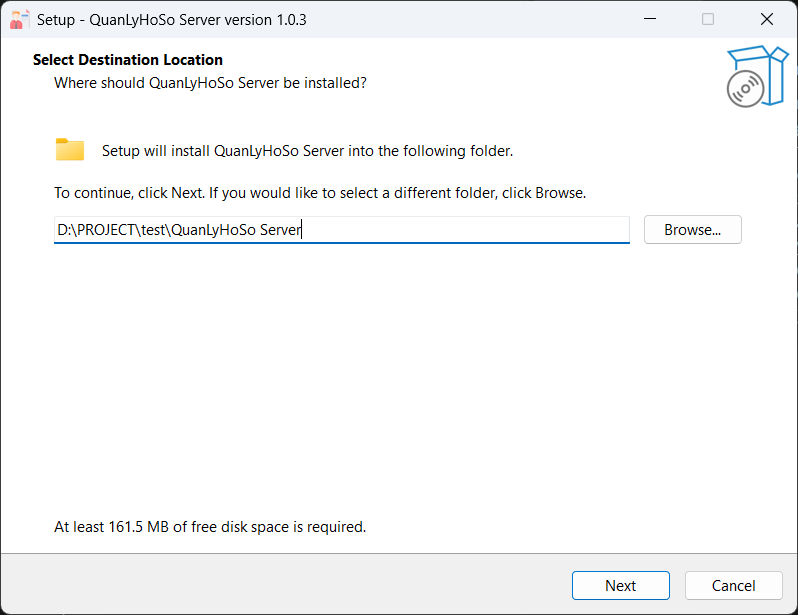

4. Tại màn hình **Select Additional Tasks**:
   - Chọn **Create a desktop shortcut** nếu muốn tạo biểu tượng ngoài màn hình.
   - Nên chọn **Start QuanLyHoSo Server when I sign in to Windows** để Server tự khởi động khi đăng nhập Windows.
   - Chọn **Next**.

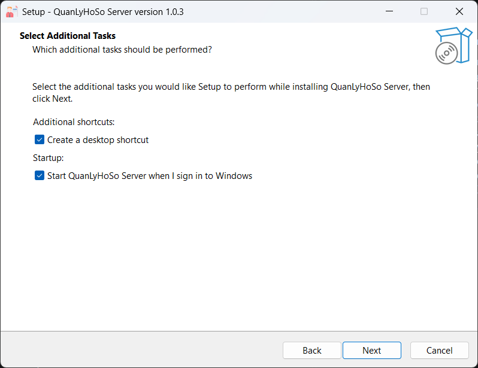

5. Kiểm tra lại thông tin tại màn hình **Ready to Install**, rồi chọn **Install**.

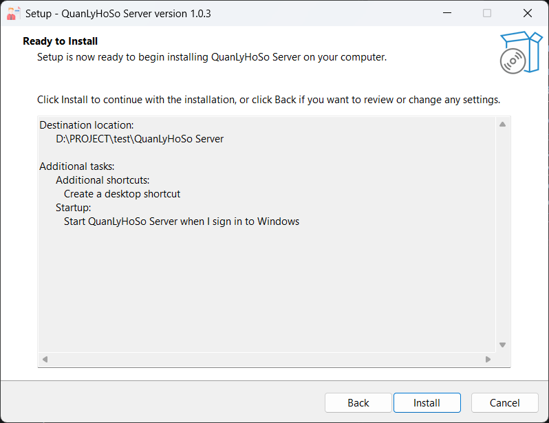

6. Chờ bộ cài hoàn tất việc sao chép file và cấu hình kết nối mạng.

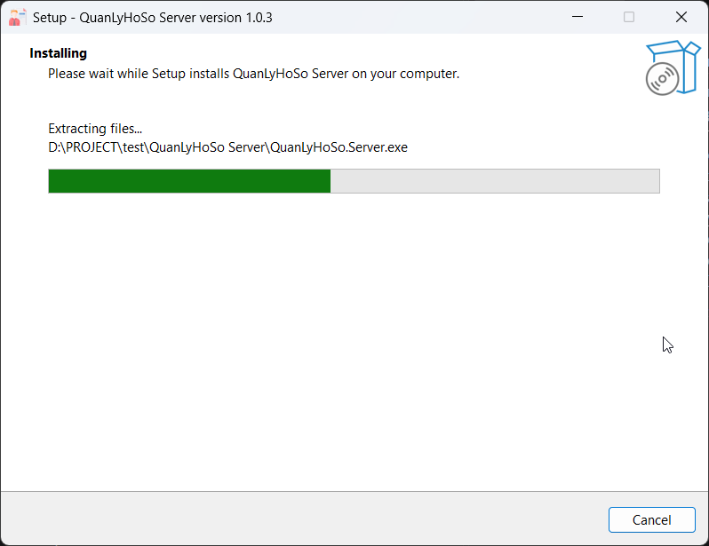

7. Tại màn hình hoàn tất, giữ chọn **Launch QuanLyHoSo Server** và chọn **Finish**.

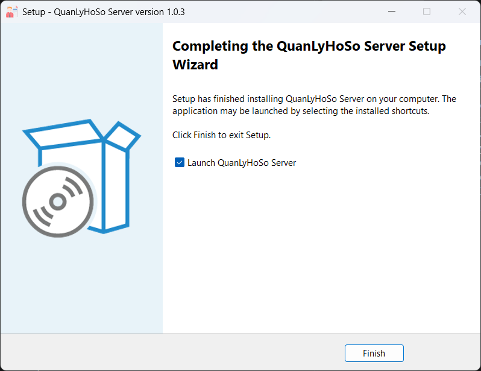

8. Trên bảng điều khiển Server, kiểm tra trạng thái **Đang hoạt động** và ghi lại **Địa chỉ kết nối**, ví dụ `http://SERVER-PC:5055` hoặc `http://192.168.1.10:5055`. Dùng nút sao chép bên cạnh địa chỉ để tránh nhập sai khi cài Client.

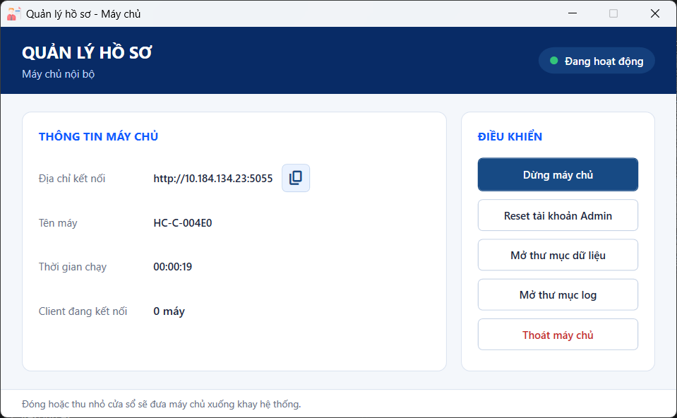

Giữ Server chạy trong thời gian các máy Client sử dụng phần mềm. Có thể đóng hoặc thu nhỏ cửa sổ để đưa Server xuống khay hệ thống; chỉ nút **Thoát máy chủ** mới dừng hoàn toàn Server.

Bộ cài Server tự đăng ký URL và mở cổng TCP `5055` cho các thiết bị trong cùng mạng LAN. Dữ liệu chính được lưu tại:

```text
C:\ProgramData\QuanLyHoSo\Data\quanlyhoso.db
```

File đính kèm và biểu mẫu Word được lưu tập trung cạnh cơ sở dữ liệu tại:

```text
C:\ProgramData\QuanLyHoSo\Data\QuanLyHoSoFiles\Attachments
C:\ProgramData\QuanLyHoSo\Data\QuanLyHoSoFiles\GeneratedDocuments
```

Không tự ý xóa hoặc di chuyển thư mục `QuanLyHoSoFiles`. Khi sao lưu để phòng mất dữ liệu, nên dùng chức năng **Sao lưu ngay** trong phần mềm để tạo gói `.qlhbackup`; gói này chứa cả cơ sở dữ liệu và toàn bộ kho file. File `.db` cũ vẫn có thể khôi phục nhưng chỉ chứa dữ liệu SQLite, không chứa file đính kèm hoặc biểu mẫu đã tạo.

Ở lần cài mới, hệ thống tạo database trống, các danh mục mặc định và tài khoản quản trị `admin` với mật khẩu ban đầu `admin123`. Hệ thống không tạo hồ sơ minh họa trong database của khách hàng. Người dùng phải đổi mật khẩu quản trị sau lần đăng nhập đầu tiên.

## 2. Cài từng máy Client

1. Đảm bảo máy Client cùng mạng LAN với máy Server và Server đang ở trạng thái **Đang hoạt động**.
2. Chép và chạy `QuanLyHoSo-Client-Setup-1.0.0-win-x64.exe`.
3. Tại màn hình **Select Destination Location**, giữ thư mục mặc định hoặc chọn **Browse...** để đổi thư mục cài đặt, sau đó chọn **Next**.

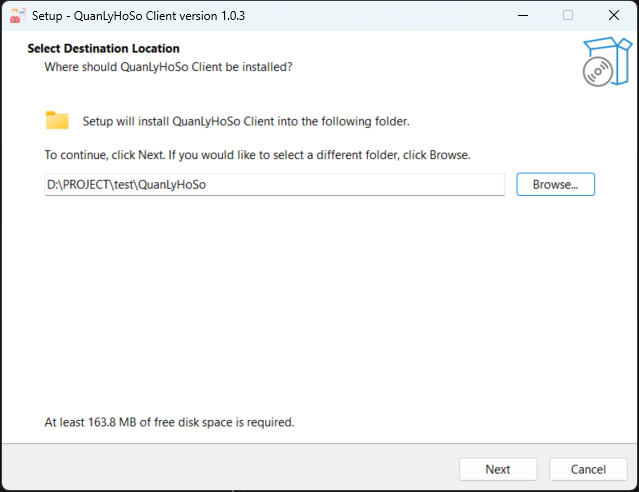

4. Tại màn hình **Server connection**, nhập đúng **Địa chỉ kết nối** đã lấy từ bảng điều khiển Server vào ô **Server address**, rồi chọn **Next**.

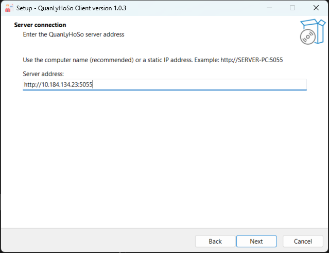

Bộ cài sẽ thử kết nối tới Server. Nếu xuất hiện cảnh báo không kết nối được, kiểm tra lại:

- Server đang chạy.
- Hai máy đang ở cùng mạng LAN.
- Địa chỉ máy hoặc địa chỉ IP đã nhập đúng.
- Cổng `5055` không bị thiết bị mạng hoặc phần mềm bảo mật chặn.

Ví dụ URL hợp lệ:

```text
http://SERVER-PC:5055
http://192.168.1.10:5055
```

Không nhập `http://0.0.0.0:5055` trên Client. Địa chỉ `0.0.0.0` chỉ được Server dùng để lắng nghe kết nối.

5. Tại màn hình **Select Additional Tasks**, chọn **Create a desktop shortcut** nếu muốn tạo biểu tượng ngoài màn hình, rồi chọn **Next**.

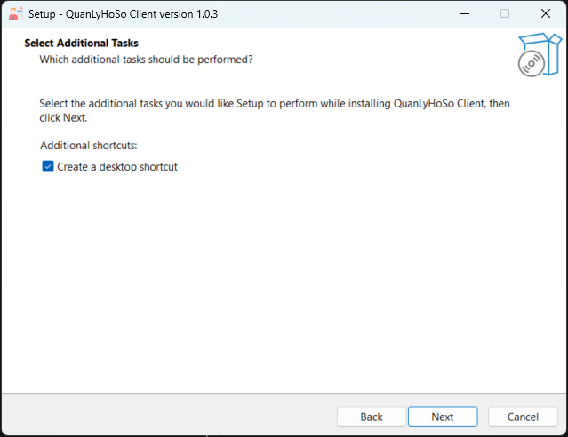

6. Kiểm tra lại thông tin tại màn hình **Ready to Install**, rồi chọn **Install**.

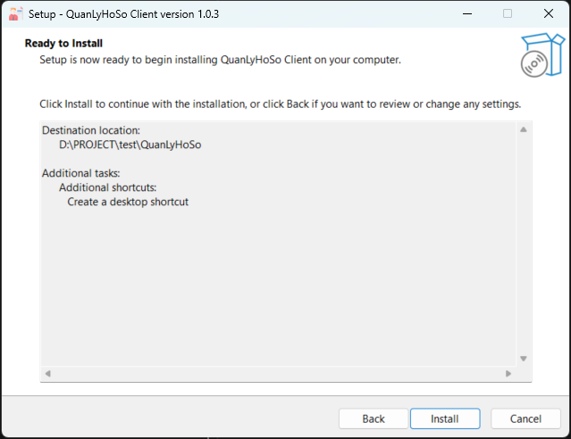

7. Chờ bộ cài hoàn tất việc sao chép file.

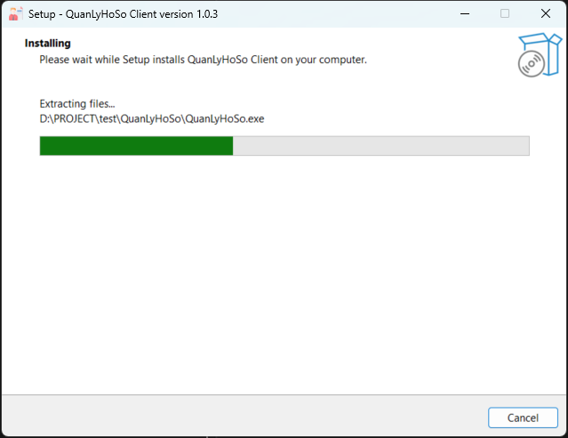

8. Tại màn hình hoàn tất, giữ chọn **Launch QuanLyHoSo Client** và chọn **Finish** để mở phần mềm.

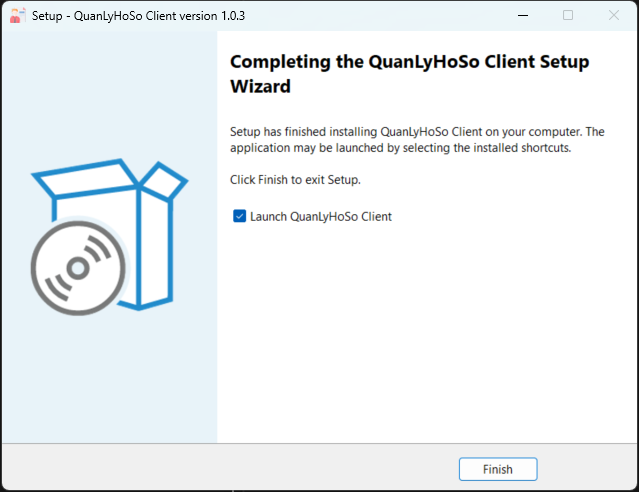

## 3. Cài Client tự động

Có thể truyền URL của Server bằng tham số khi cài đặt tự động hoặc theo kịch bản:

```powershell
.\QuanLyHoSo-Client-Setup-1.0.0-win-x64.exe /SERVERURL="http://SERVER-PC:5055"
```

## 4. Quản lý phiên bản và cập nhật Client

Server và Client được quản lý phiên bản độc lập. Server không từ chối đăng nhập hoặc API nghiệp vụ chỉ vì số phiên bản Client khác số phiên bản Server. Bước kiểm tra kết nối trong bộ cài Client chỉ xác nhận Server đang hoạt động và có thể truy cập qua mạng.

Chức năng **Cập nhật phần mềm** trong trang Cài đặt chỉ thay thế ứng dụng Client trên máy trạm đang sử dụng. Gói cập nhật nội bộ phải là file ZIP có tên `QuanLyHoSo-Client-<phiên_bản>.zip`, ví dụ `QuanLyHoSo-Client-1.0.1.zip`. Gói này không cập nhật ứng dụng Server và không thay đổi cơ sở dữ liệu trên Server.

Khi triển khai bản Client mới:

1. Yêu cầu người dùng lưu công việc và đóng ứng dụng Client khi bắt đầu cài đặt.
2. Phân phối gói Client mới qua chức năng cập nhật nội bộ hoặc bộ cài Client.
3. Mở lại Client, đăng nhập và kiểm tra các chức năng chính.

Chỉ cập nhật Server khi bản phát hành có thay đổi dành riêng cho Server, cơ sở dữ liệu hoặc LAN API. Trước khi cập nhật Server, cần sao lưu dữ liệu và thông báo thời gian bảo trì; không cần đổi số phiên bản Client chỉ để trùng với Server.

## 5. Lưu ý

- Hai bộ cài chỉ dành cho Windows 64-bit.
- Client không yêu cầu quyền Administrator.
- Server yêu cầu quyền Administrator khi cài hoặc gỡ để cấu hình URL và Windows Firewall.
- Hai ứng dụng đã kèm .NET Runtime; máy đích không cần cài .NET riêng.
- Bộ cài chưa có chữ ký số của nhà phát hành nên Windows SmartScreen có thể hiển thị cảnh báo **Unknown publisher**. Chỉ tiếp tục nếu file được nhận từ nguồn bàn giao tin cậy và mã SHA-256 khớp với file `SHA256.txt` đi kèm bản phát hành.
