# HƯỚNG DẪN SỬ DỤNG PHẦN MỀM QUẢN LÝ HỒ SƠ

**Phạm vi:** Tiếp nhận, phân loại, xử lý và theo dõi hồ sơ  
**Đối tượng sử dụng:** Quản trị hệ thống, Lãnh đạo và Cán bộ  
**Phiên bản tài liệu:** 1.0  
**Ngày cập nhật:** 11/09/2026

> Các tên người, số điện thoại, địa chỉ, mã hồ sơ và số liệu trong hình là dữ liệu minh họa. Giao diện và số liệu thực tế thay đổi theo tài khoản, quyền được cấp và thời điểm sử dụng.

---

## Mục lục

1. [Giới thiệu hệ thống](#1-giới-thiệu-hệ-thống)
2. [Vai trò và phạm vi sử dụng](#2-vai-trò-và-phạm-vi-sử-dụng)
3. [Khởi động máy chủ](#3-khởi-động-máy-chủ)
4. [Đăng nhập và đổi mật khẩu lần đầu](#4-đăng-nhập-và-đổi-mật-khẩu-lần-đầu)
5. [Thao tác chung](#5-thao-tác-chung)
6. [Trang Tổng quan](#6-trang-tổng-quan)
7. [Trang Nhập dữ liệu](#7-trang-nhập-dữ-liệu)
8. [Trang Danh sách hồ sơ](#8-trang-danh-sách-hồ-sơ)
9. [Trang Phân loại và Xử lý](#9-trang-phân-loại-và-xử-lý)
10. [Trang Theo dõi cán bộ](#10-trang-theo-dõi-cán-bộ)
11. [Trang Cài đặt](#11-trang-cài-đặt)
12. [Hướng dẫn theo từng vai trò](#12-hướng-dẫn-theo-từng-vai-trò)
13. [Xử lý sự cố thường gặp](#13-xử-lý-sự-cố-thường-gặp)
14. [Nguyên tắc an toàn dữ liệu](#14-nguyên-tắc-an-toàn-dữ-liệu)

---

## 1. Giới thiệu hệ thống

Phần mềm Quản lý hồ sơ hỗ trợ:

- Tiếp nhận và lưu thông tin hồ sơ.
- Phân loại, phân công và theo dõi quá trình xử lý.
- Quản lý tài liệu đính kèm và tạo biểu mẫu Word theo quy trình.
- Tra cứu, lọc, xem chi tiết và xuất danh sách hồ sơ ra Excel.
- Theo dõi tiến độ, thời hạn, tỷ lệ đúng hạn và KPI của cán bộ.
- Gửi thông báo, nhắc nhở và chỉ tiêu xử lý.
- Quản lý danh mục, người dùng, nhật ký, sao lưu và khôi phục dữ liệu.

Hệ thống gồm hai chương trình:

- **Máy chủ:** lưu cơ sở dữ liệu và cung cấp kết nối nội bộ.
- **Ứng dụng người dùng:** nơi Admin, Lãnh đạo và Cán bộ đăng nhập để làm việc.

---

## 2. Vai trò và phạm vi sử dụng

| Chức năng | Admin | Lãnh đạo | Cán bộ |
|---|:---:|:---:|:---:|
| Xem Tổng quan | Có | Có | Có, theo hồ sơ được giao |
| Nhập hồ sơ mới | Có | Không | Không |
| Xem danh sách hồ sơ | Có | Có | Có, theo phạm vi được giao |
| Sửa/xóa hồ sơ | Có | Chỉ xem | Chỉ sửa hồ sơ mình phụ trách |
| Cập nhật quy trình xử lý | Có | Chỉ xem | Có, với hồ sơ mình phụ trách |
| Theo dõi toàn bộ cán bộ | Có | Có | Không, chỉ xem bản thân |
| Gửi thông báo/nhắc nhở/đặt KPI | Có quyền quản trị phù hợp | Có | Không |
| Quản lý danh mục | Có | Không | Không |
| Quản lý người dùng | Có | Không | Không |
| Sao lưu/khôi phục dữ liệu | Có | Không | Không |
| Đổi mật khẩu, xem nhật ký cá nhân | Có | Có | Có |

> Nội dung hiển thị trong ứng dụng phụ thuộc quyền của tài khoản. Nếu không thấy một chức năng, hãy kiểm tra vai trò trước khi báo lỗi.

---

## 3. Khởi động máy chủ

Phần này dành cho người quản trị máy chủ. Người dùng thông thường không cần thao tác nếu máy chủ đã hoạt động.

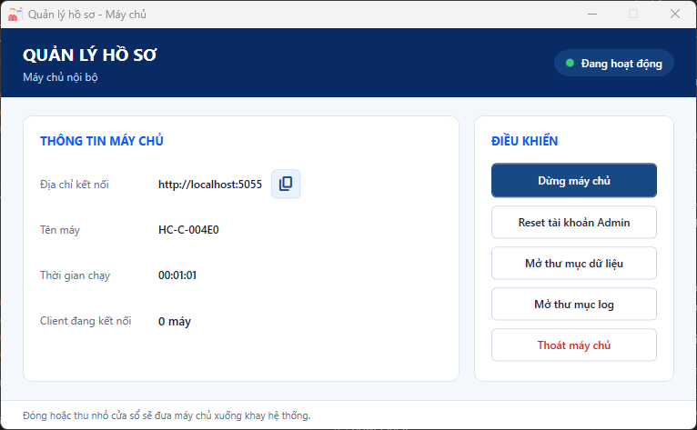

### 3.1 Kiểm tra trạng thái

1. Mở chương trình **Quản lý hồ sơ - Máy chủ** trên máy được chọn làm máy chủ.
2. Kiểm tra trạng thái ở góc trên bên phải:
   - **Đang hoạt động:** máy chủ sẵn sàng nhận kết nối.
   - Nếu máy chủ đã dừng, dùng nút điều khiển để khởi động lại.
3. Kiểm tra **Địa chỉ kết nối** và **Tên máy**.
4. Dùng nút sao chép bên cạnh địa chỉ khi cần gửi URL cho máy trạm.
5. Kiểm tra số máy đang kết nối tại dòng **Client đang kết nối**.

### 3.2 Các nút quản trị

- **Dừng máy chủ:** tạm dừng kết nối từ các máy trạm.
- **Reset tài khoản Admin:** tạo mật khẩu tạm thời cho tài khoản `admin` khi mất quyền truy cập.
- **Mở thư mục dữ liệu:** mở nơi lưu cơ sở dữ liệu trên máy chủ.
- **Mở thư mục log:** mở nhật ký kỹ thuật phục vụ kiểm tra lỗi.
- **Thoát máy chủ:** đóng hoàn toàn chương trình máy chủ.

> Đóng hoặc thu nhỏ cửa sổ thông thường chỉ đưa chương trình xuống khay hệ thống; máy chủ vẫn tiếp tục hoạt động.

### 3.3 Reset tài khoản Admin

1. Bấm **Reset tài khoản Admin**.
2. Sao chép mật khẩu tạm ngay trong cửa sổ vừa mở.
3. Đăng nhập bằng tài khoản `admin` và mật khẩu tạm.
4. Hệ thống sẽ bắt buộc đổi sang mật khẩu mới.

> Mật khẩu tạm chỉ hiển thị trong cửa sổ hiện tại. Không gửi mật khẩu qua kênh công khai và không chụp màn hình chứa mật khẩu thật.

---

## 4. Đăng nhập và đổi mật khẩu lần đầu

### 4.1 Đăng nhập

1. Nhập **Tên đăng nhập**.
2. Nhập **Mật khẩu**.
3. Chọn **Ghi nhớ đăng nhập** nếu đây là máy tính cá nhân được bảo vệ.
4. Bấm **Đăng nhập**.

Nếu quên mật khẩu, bấm **Quên mật khẩu?** và liên hệ Admin. Nếu tài khoản Admin tích hợp bị mất mật khẩu, thực hiện reset tại máy chủ.

### 4.2 Đổi mật khẩu bắt buộc

Tài khoản mới, tài khoản vừa được Admin cấp lại mật khẩu hoặc tài khoản `admin` vừa reset phải đổi mật khẩu trước khi vào hệ thống.

1. Nhập **Mật khẩu hiện tại** hoặc mật khẩu tạm.
2. Nhập **Mật khẩu mới** có ít nhất 6 ký tự.
3. Nhập lại mật khẩu mới chính xác.
4. Bấm **Đổi mật khẩu và tiếp tục**.

### 4.3 Đăng xuất

1. Hoàn tất và lưu công việc đang làm.
2. Bấm **Đăng xuất** ở cuối thanh bên trái.
3. Đăng nhập lại nếu muốn chuyển tài khoản.

---

## 5. Thao tác chung

### 5.1 Thanh điều hướng

Thanh bên trái chứa các trang được phép sử dụng. Trang đang mở có nền xanh sáng. Tên và vai trò hiện tại xuất hiện gần cuối thanh bên.

Các mục có thể gồm:

- **Tổng quan**
- **Nhập dữ liệu**
- **Danh sách hồ sơ**
- **Phân loại & Xử lý**
- **Theo dõi cán bộ**
- **Cài đặt**
- **Đăng xuất**

### 5.2 Ý nghĩa các biểu tượng thường gặp

| Biểu tượng/màu | Ý nghĩa |
|---|---|
| Con mắt màu xanh | Xem chi tiết hồ sơ |
| Bút chì màu cam | Sửa thông tin hồ sơ |
| Biểu tượng quy trình màu xanh lá | Mở trang xử lý hồ sơ |
| Thùng rác màu đỏ | Chuyển hồ sơ vào thùng rác hoặc xóa mục |
| Mũi tên tải xuống | Tải tài liệu về máy |
| Nút **X** | Đóng cửa sổ chi tiết hoặc hộp thoại |

### 5.3 Thông báo chưa đọc

Khi có thông báo mới, huy hiệu đỏ hiển thị cạnh mục **Theo dõi cán bộ**. Số lượng được cập nhật nền định kỳ mà không cần chuyển qua lại giữa các trang.

---

## 6. Trang Tổng quan

Trang Tổng quan giúp nắm nhanh tình hình tiếp nhận và xử lý hồ sơ trong kỳ.

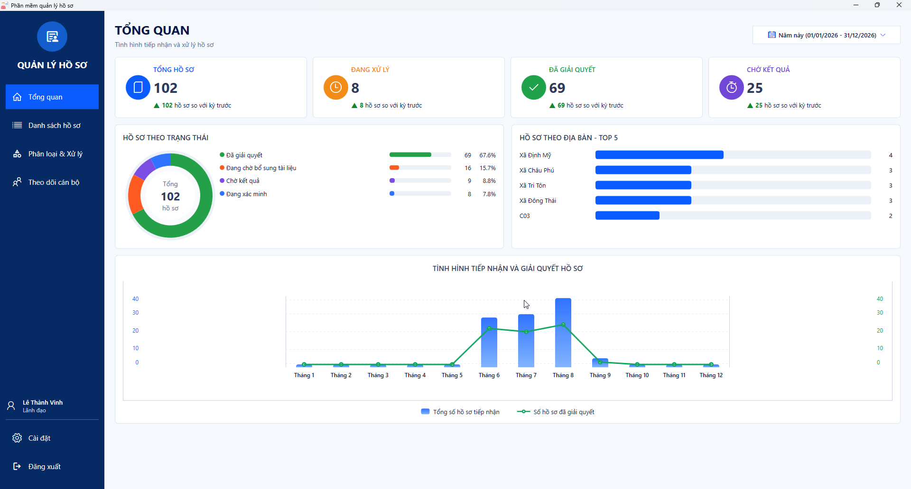

### 6.1 Nội dung chính

- **Tổng hồ sơ:** tổng số hồ sơ trong khoảng thời gian đang chọn.
- **Đang xử lý:** hồ sơ chưa hoàn tất.
- **Đã giải quyết:** hồ sơ đã kết thúc xử lý.
- **Chờ kết quả:** hồ sơ đang chờ kết quả hoặc tài liệu tiếp theo.
- Biểu đồ **Hồ sơ theo trạng thái**.
- Bảng xếp hạng **Hồ sơ theo địa bàn - Top 5**.
- Biểu đồ **Tình hình tiếp nhận và giải quyết hồ sơ** theo tháng.

### 6.2 Lọc theo thời gian

1. Bấm bộ chọn thời gian ở góc trên bên phải.
2. Chọn kỳ có sẵn như năm nay, tháng này hoặc khoảng thời gian phù hợp.
3. Số liệu và biểu đồ sẽ được tải lại theo kỳ đã chọn.

> Với Cán bộ, số liệu chủ yếu phản ánh hồ sơ được phân công cho chính người đang đăng nhập. Admin và Lãnh đạo xem phạm vi tổng hợp rộng hơn.

---

## 7. Trang Nhập dữ liệu

Trang này chỉ hiển thị cho Admin, dùng để tạo hồ sơ mới hoặc sửa hồ sơ hiện có.

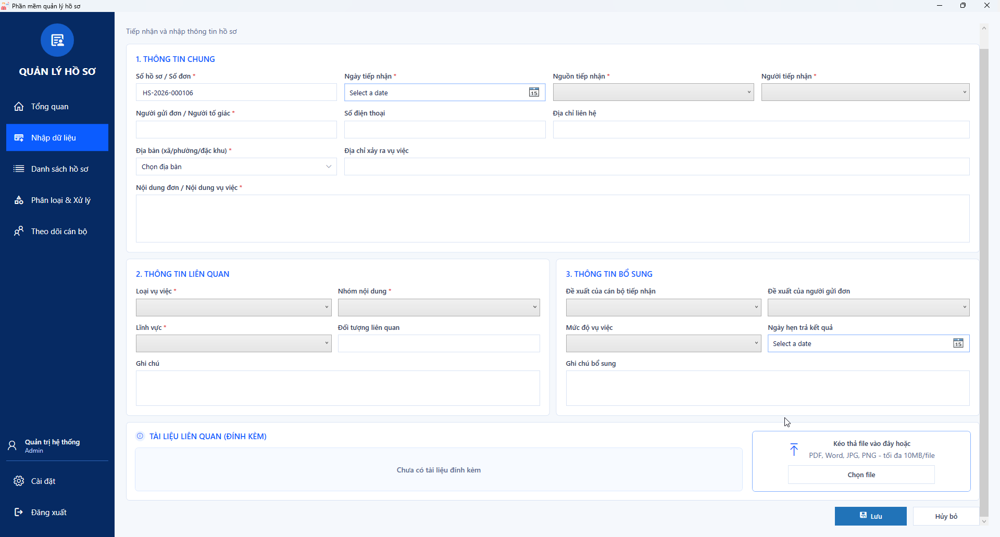

### 7.1 Nhập thông tin chung

Điền các trường có dấu `*`:

1. **Số hồ sơ/Số đơn:** được hệ thống gợi ý theo quy tắc mã hồ sơ.
2. **Ngày tiếp nhận**.
3. **Nguồn tiếp nhận**.
4. **Người tiếp nhận**.
5. **Người gửi đơn/Người tố giác**.
6. **Số điện thoại** và **Địa chỉ liên hệ** nếu có.
7. **Địa bàn** và **Địa chỉ xảy ra vụ việc**.
8. **Nội dung đơn/Nội dung vụ việc**.

### 7.2 Nhập thông tin phân loại

Chọn:

- Loại vụ việc.
- Nhóm nội dung.
- Lĩnh vực.
- Đối tượng liên quan.
- Đề xuất của cán bộ tiếp nhận.
- Đề xuất của người gửi đơn.
- Mức độ vụ việc.
- Ngày hẹn trả kết quả.
- Ghi chú và ghi chú bổ sung nếu cần.

### 7.3 Thêm tài liệu đính kèm

1. Kéo thả file vào vùng **Tài liệu liên quan**, hoặc bấm **Chọn file**.
2. Kiểm tra tên và dung lượng file trong danh sách.
3. Có thể tải xuống hoặc xóa file khỏi danh sách bằng biểu tượng tương ứng.

Định dạng hỗ trợ: PDF, Word (`.doc`, `.docx`), JPG/JPEG và PNG. Dung lượng tối đa 10 MB cho mỗi file.

### 7.4 Lưu hoặc hủy

- Bấm **Lưu** để tạo hồ sơ hoặc **Cập nhật** khi đang sửa.
- Bấm **Hủy bỏ** nếu không muốn giữ thay đổi.

> Hãy kiểm tra kỹ số hồ sơ, người gửi, địa bàn và tài liệu trước khi lưu. Không nên mở cùng một hồ sơ để sửa trên nhiều máy cùng lúc.

---

## 8. Trang Danh sách hồ sơ

### 8.1 Xem danh sách

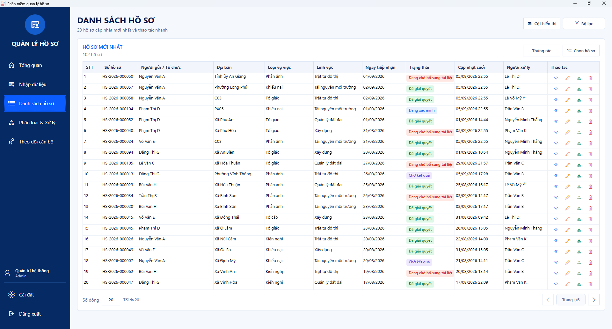

Mỗi dòng thể hiện mã hồ sơ, người gửi, địa bàn, loại vụ việc, lĩnh vực, ngày tiếp nhận, trạng thái, thời điểm cập nhật và người xử lý.

Các thao tác ở cuối dòng phụ thuộc quyền:

- **Admin:** xem, sửa, mở xử lý và xóa.
- **Lãnh đạo:** xem chi tiết.
- **Cán bộ:** xem, sửa và xử lý hồ sơ do mình phụ trách.

### 8.2 Chọn cột hiển thị

1. Bấm **Cột hiển thị**.
2. Chọn hoặc bỏ chọn các cột muốn xem.
3. Đóng bảng chọn để trở lại danh sách.

### 8.3 Lọc, tìm kiếm và sắp xếp

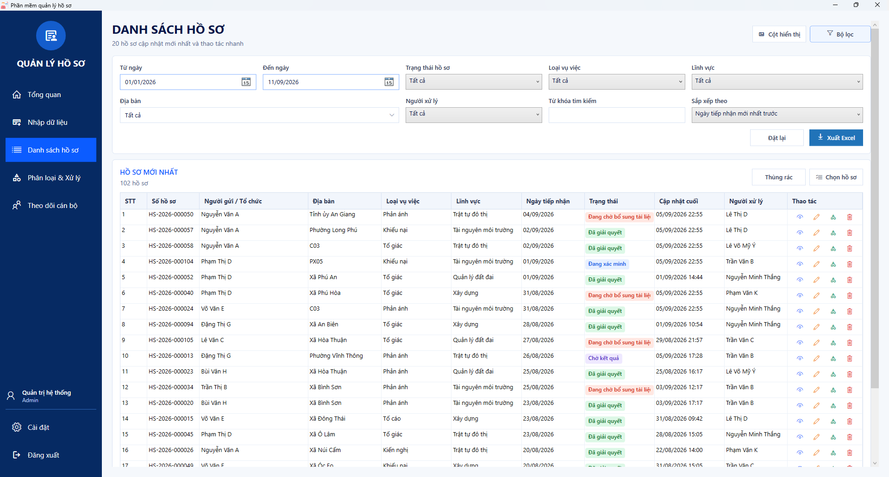

1. Bấm **Bộ lọc**.
2. Chọn một hoặc nhiều điều kiện:
   - Từ ngày, đến ngày.
   - Trạng thái hồ sơ.
   - Loại vụ việc.
   - Lĩnh vực.
   - Địa bàn.
   - Người xử lý.
   - Từ khóa tìm kiếm.
   - Cách sắp xếp.
3. Xem kết quả đã lọc trong bảng.
4. Bấm **Đặt lại** để xóa toàn bộ điều kiện.

### 8.4 Xuất Excel

1. Thiết lập bộ lọc để xác định phạm vi dữ liệu cần xuất.
2. Bấm **Xuất Excel**.
3. Chọn vị trí và tên file nếu hệ thống yêu cầu.
4. Chờ thông báo hoàn tất rồi mở file kiểm tra.

> File xuất áp dụng các điều kiện lọc hiện tại. Cột chọn hàng không được đưa vào file Excel.

### 8.5 Xem chi tiết hồ sơ

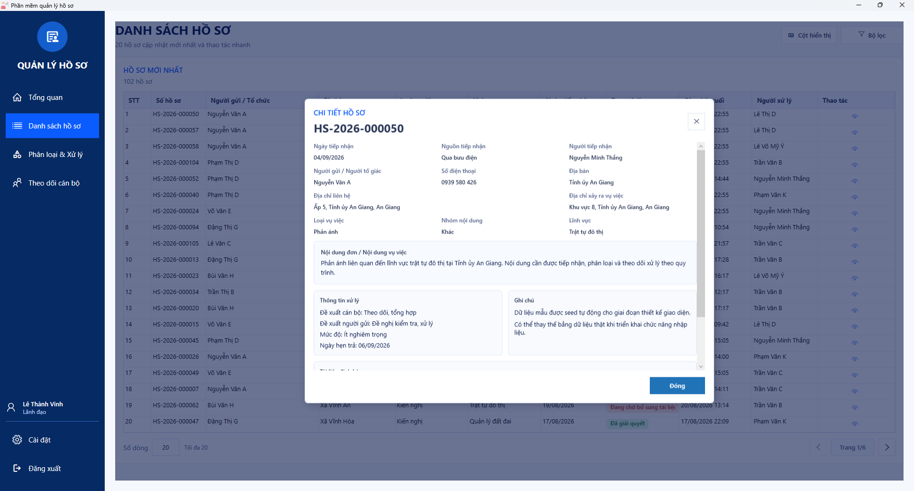

1. Bấm biểu tượng **con mắt** trên dòng hồ sơ.
2. Cuộn trong cửa sổ để xem đầy đủ thông tin, ghi chú và tài liệu đính kèm.
3. Bấm **Đóng** hoặc nút **X** để quay lại danh sách.

### 8.6 Chọn và xóa nhiều hồ sơ

Chức năng này chỉ dành cho Admin.

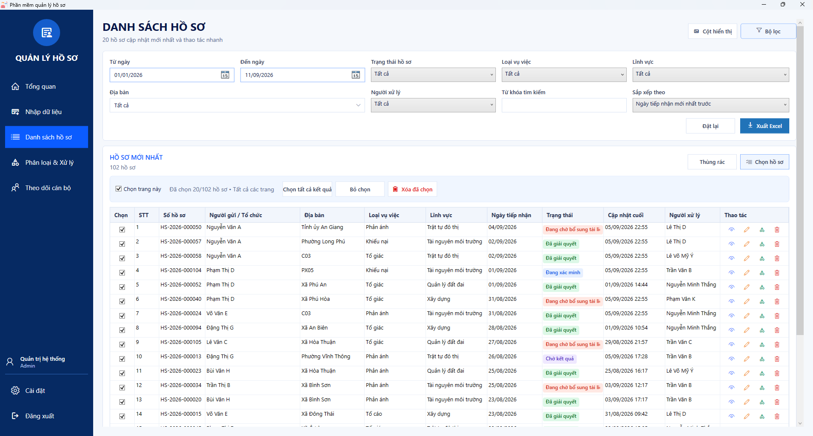

1. Bấm **Chọn hồ sơ** để bật chế độ chọn nhiều.
2. Chọn từng dòng hoặc dùng **Chọn trang này**.
3. Dùng **Chọn tất cả kết quả** nếu muốn chọn toàn bộ hồ sơ phù hợp với bộ lọc, kể cả ở trang khác.
4. Dùng **Bỏ chọn** để xóa lựa chọn hiện tại.
5. Bấm **Xóa đã chọn** và đọc kỹ số lượng trong hộp xác nhận.

Hồ sơ bị xóa ở bước này chỉ được chuyển vào thùng rác và có thể khôi phục.

### 8.7 Thùng rác hồ sơ

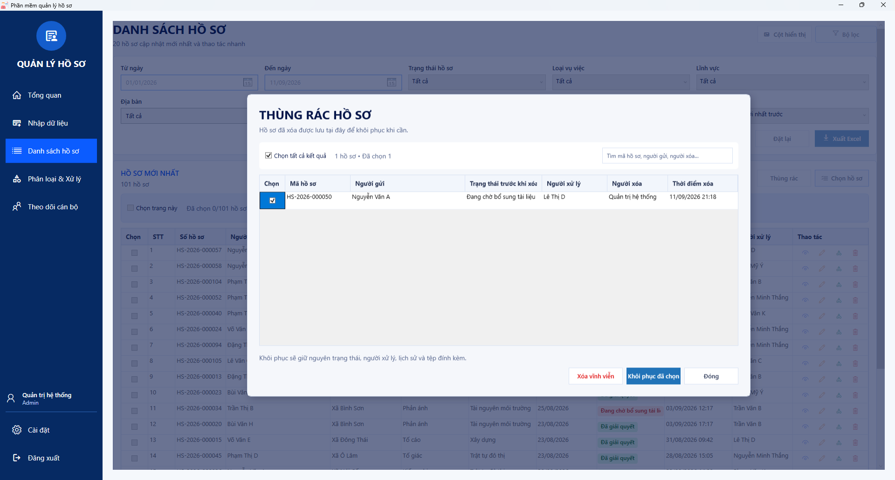

1. Bấm **Thùng rác** trên trang Danh sách hồ sơ.
2. Tìm kiếm theo mã hồ sơ, người gửi hoặc người xóa nếu cần.
3. Chọn một hoặc nhiều hồ sơ.
4. Chọn:
   - **Khôi phục đã chọn:** đưa hồ sơ trở lại danh sách và giữ lịch sử, trạng thái, người xử lý, tài liệu.
   - **Xóa vĩnh viễn:** loại bỏ dữ liệu hồ sơ khỏi cơ sở dữ liệu.
5. Bấm **Đóng** để quay lại danh sách.

> Xóa vĩnh viễn không thể hoàn tác bằng giao diện. Chỉ thực hiện sau khi đã kiểm tra mã hồ sơ và có bản sao lưu phù hợp.

---

## 9. Trang Phân loại và Xử lý

### 9.1 Danh sách việc cần xử lý

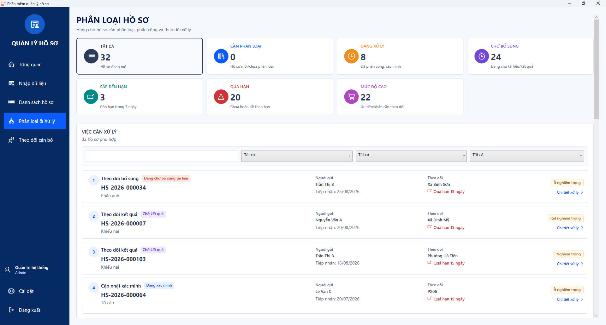

Các thẻ phía trên cho biết số lượng:

- Tất cả hồ sơ đang mở.
- Cần phân loại.
- Đang xử lý.
- Chờ bổ sung.
- Sắp đến hạn.
- Quá hạn.
- Mức độ cao.

Thao tác:

1. Bấm một thẻ để tập trung vào nhóm hồ sơ tương ứng.
2. Dùng ô tìm kiếm và các bộ lọc trong vùng **Việc cần xử lý**.
3. Bấm **Chi tiết xử lý** trên hồ sơ cần làm việc.

Lãnh đạo có thể xem toàn bộ hàng chờ nhưng không cập nhật nội dung xử lý. Cán bộ chỉ thấy và cập nhật hồ sơ do mình phụ trách.

### 9.2 Trang Chi tiết xử lý hồ sơ

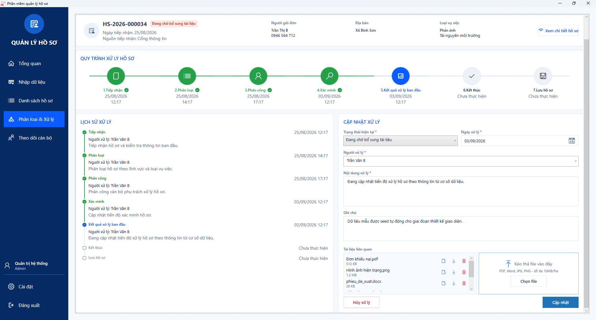

Trang gồm:

- Thông tin tóm tắt hồ sơ.
- Sơ đồ bảy bước của quy trình.
- Lịch sử xử lý theo thời gian.
- Khối cập nhật trạng thái, ngày xử lý, người xử lý, nội dung và ghi chú.
- Danh sách tài liệu liên quan.

Quy trình tiêu chuẩn:

1. Tiếp nhận.
2. Phân loại.
3. Phân công.
4. Xác minh.
5. Kết quả xử lý ban đầu.
6. Kết thúc.
7. Lưu hồ sơ.

### 9.3 Cập nhật tiến độ

1. Kiểm tra mã hồ sơ và bước hiện tại.
2. Chọn **Trạng thái hiện tại** phù hợp với nghiệp vụ thực tế.
3. Chọn **Ngày xử lý**.
4. Kiểm tra **Người xử lý**.
5. Nhập rõ **Nội dung xử lý** và **Ghi chú**.
6. Thêm hoặc kiểm tra tài liệu liên quan.
7. Bấm **Cập nhật**.
8. Kiểm tra bước mới và mục vừa tạo trong **Lịch sử xử lý**.

> Cán bộ không được đưa hồ sơ quay lại các bước trước phân công. Admin có phạm vi cập nhật rộng hơn nhưng vẫn phải tuân thủ quy trình nghiệp vụ.

### 9.4 Chuyển cơ quan khác

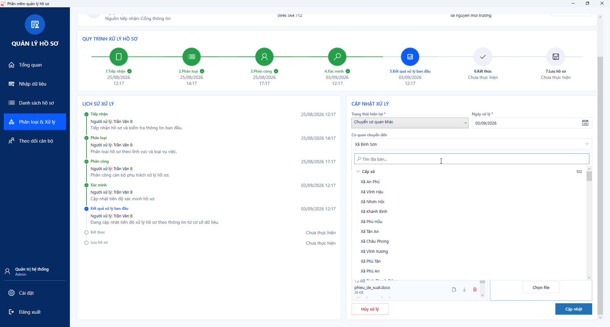

1. Chọn trạng thái **Chuyển cơ quan khác**.
2. Mở trường **Cơ quan chuyển đến**.
3. Tìm theo tên hoặc mở nhóm địa bàn phù hợp.
4. Chọn đúng cơ quan tiếp nhận.
5. Nhập nội dung bàn giao và bấm **Cập nhật**.

### 9.5 Tạo biểu mẫu Word ở bước kết quả ban đầu

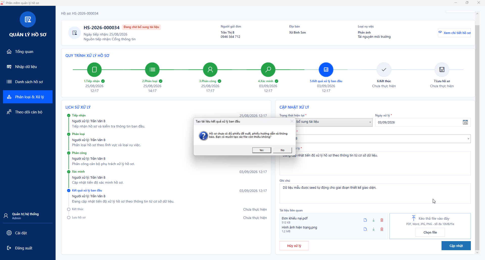

Khi lưu bước **Kết quả xử lý ban đầu**, nếu hồ sơ còn thiếu các biểu mẫu chuẩn, hệ thống hỏi có tạo file hay không.

- Chọn **Yes** để tạo các file còn thiếu từ mẫu Word.
- Chọn **No** nếu chưa muốn tạo.

Hệ thống có thể tạo:

- Phiếu đề xuất.
- Phiếu hướng dẫn.
- Thông báo.

Sau khi tạo, kiểm tra file trong **Tài liệu liên quan**, tải xuống và mở để rà soát nội dung.

### 9.6 Lưu ý về tài liệu đính kèm

- Không xóa file đã dùng làm căn cứ xử lý nếu chưa có bản thay thế.
- Nếu thấy tên tài liệu nhưng không mở được, đường dẫn file có thể chỉ tồn tại trên máy đã đính kèm ban đầu.
- Với hệ thống nhiều máy, cần bảo đảm file nằm ở vị trí mà máy chủ hoặc máy đang thao tác có thể truy cập.
- Sau khi cập nhật, nên quay lại rồi mở lại đúng hồ sơ để kiểm tra danh sách tài liệu đã được tải đầy đủ.

---

## 10. Trang Theo dõi cán bộ

### 10.1 Giao diện dành cho Admin và Lãnh đạo

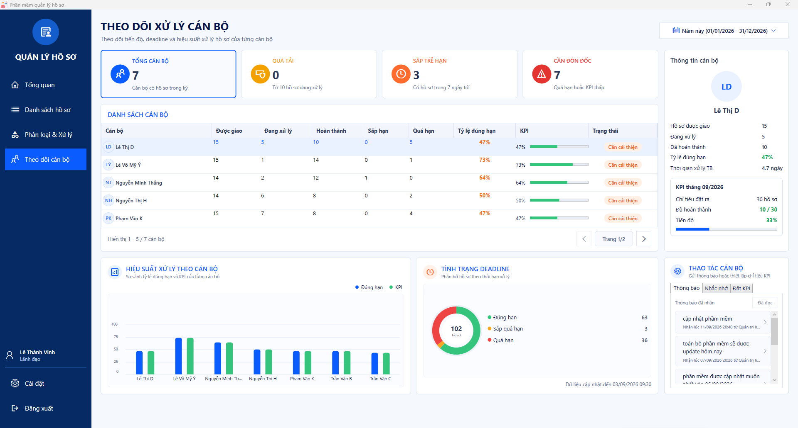

Trang hiển thị:

- Tổng số cán bộ có hồ sơ trong kỳ.
- Số cán bộ quá tải, hồ sơ sắp trễ hạn và cán bộ cần đôn đốc.
- Bảng số hồ sơ được giao, đang xử lý, hoàn thành, sắp hạn, quá hạn và tỷ lệ đúng hạn.
- KPI và trạng thái của từng cán bộ.
- Biểu đồ hiệu suất và tình trạng deadline.
- Thông tin chi tiết của cán bộ đang chọn.

Thao tác:

1. Chọn khoảng thời gian ở góc trên bên phải.
2. Chọn một cán bộ trong bảng.
3. Xem chi tiết thống kê và KPI ở cột bên phải.
4. Chuyển trang nếu danh sách có hơn 5 cán bộ.

### 10.2 Thông báo, nhắc nhở và đặt KPI

Trong khối **Thao tác cán bộ**, Lãnh đạo có ba tab:

- **Thông báo:** xem thông báo Admin gửi đến Lãnh đạo hoặc gửi thông tin phù hợp theo phạm vi hệ thống.
- **Nhắc nhở:** gửi nội dung đôn đốc đến cán bộ.
- **Đặt KPI:** đặt chỉ tiêu xử lý theo tháng/phạm vi áp dụng.

Khi đặt KPI, đọc kỹ nội dung xác nhận trước khi lưu. Hệ thống gửi thông tin chỉ tiêu đến từng cán bộ thuộc phạm vi áp dụng.

Thông báo chưa đọc được in đậm. Bấm vào một thông báo để xem đầy đủ; thông báo sẽ được đánh dấu đã đọc. Có thể dùng nút **Đã đọc** để đánh dấu các nội dung đã tiếp nhận.

### 10.3 Giao diện dành cho Cán bộ

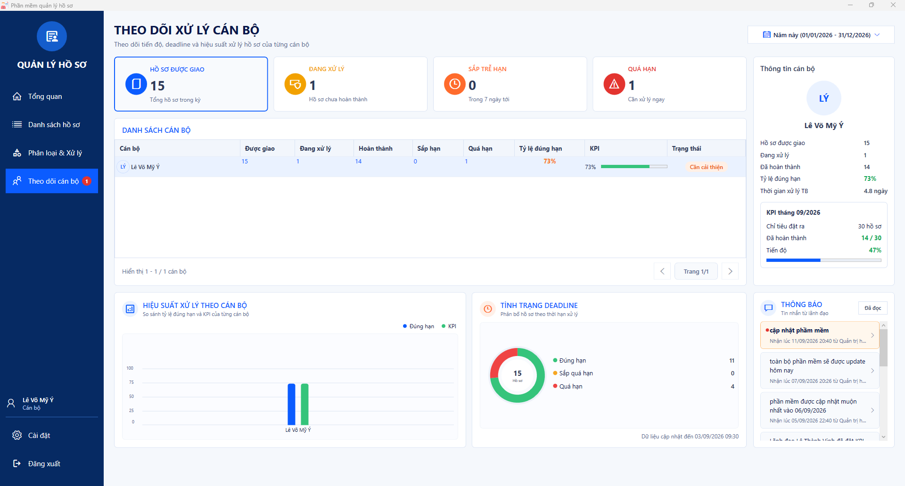

Cán bộ chỉ xem dữ liệu của mình:

- Tổng hồ sơ được giao.
- Hồ sơ đang xử lý.
- Hồ sơ sắp trễ hạn và quá hạn.
- Tỷ lệ đúng hạn và tiến độ KPI.
- Biểu đồ hiệu suất cá nhân.
- Danh sách thông báo từ Lãnh đạo/Admin.

Khi huy hiệu đỏ xuất hiện cạnh **Theo dõi cán bộ**:

1. Mở trang **Theo dõi cán bộ**.
2. Đọc các thông báo in đậm hoặc có dấu chấm đỏ.
3. Bấm thông báo để xem đầy đủ nội dung.
4. Ưu tiên xử lý hồ sơ quá hạn hoặc được nhắc nhở.

---

## 11. Trang Cài đặt

### 11.1 Chức năng chung cho mọi tài khoản

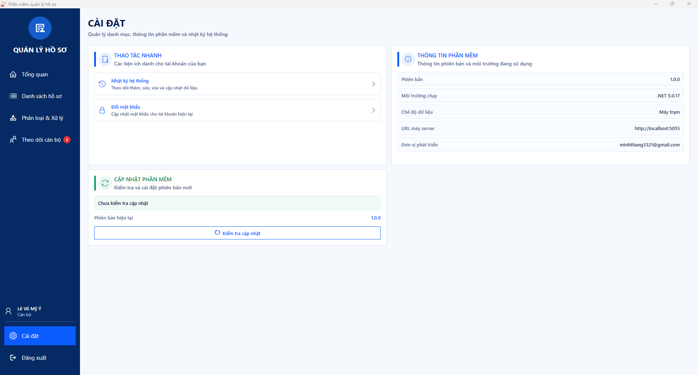

Các chức năng chung gồm:

- **Nhật ký hệ thống:** xem lịch sử thao tác của tài khoản hiện tại.
- **Đổi mật khẩu:** cập nhật mật khẩu cá nhân.
- **Thông tin phần mềm:** phiên bản, môi trường chạy, chế độ dữ liệu và URL máy chủ.
- **Cập nhật phần mềm:** kiểm tra và cài đặt gói cập nhật nội bộ.

### 11.2 Xem nhật ký hệ thống

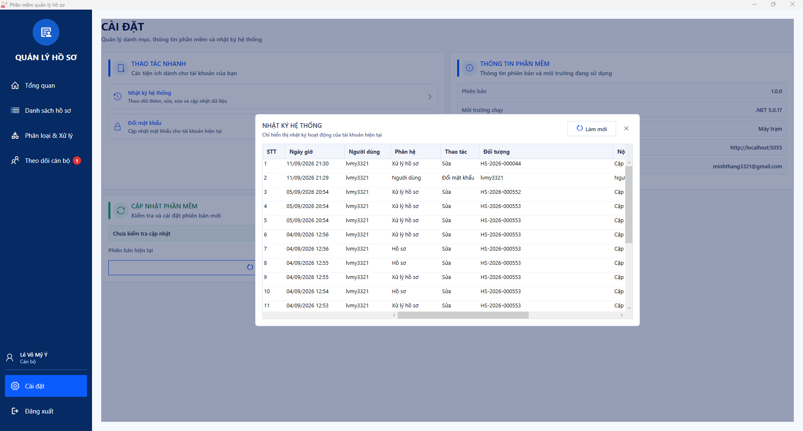

1. Bấm **Nhật ký hệ thống**.
2. Xem ngày giờ, phân hệ, thao tác, đối tượng và nội dung.
3. Bấm **Làm mới** ở đầu cửa sổ để lấy dữ liệu mới nhất.
4. Bấm **X** để đóng.

Admin xem được nhật ký hệ thống rộng hơn; Lãnh đạo và Cán bộ chủ yếu thấy nhật ký của tài khoản đang đăng nhập.

### 11.3 Đổi mật khẩu

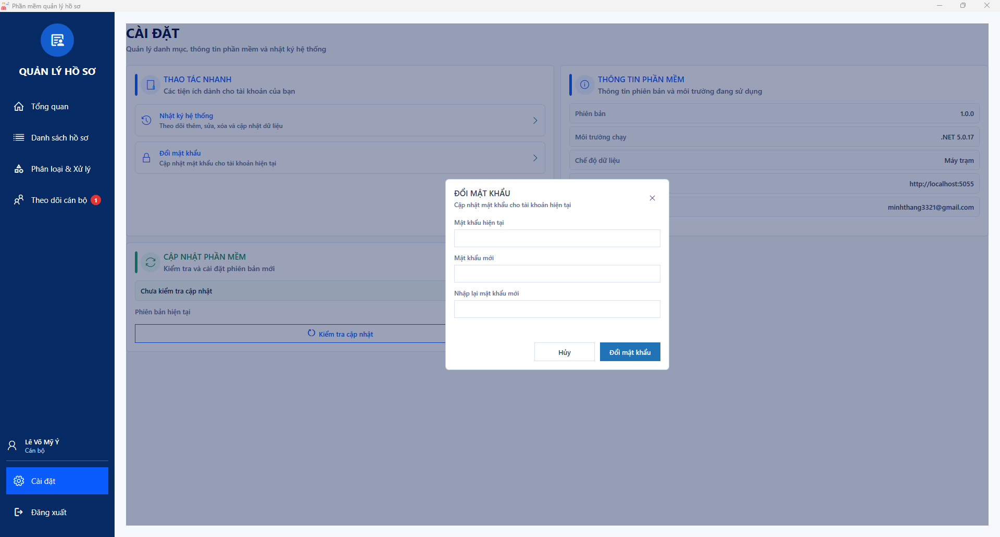

1. Bấm **Đổi mật khẩu**.
2. Nhập mật khẩu hiện tại.
3. Nhập mật khẩu mới và nhập lại chính xác.
4. Bấm **Đổi mật khẩu**.

### 11.4 Cập nhật phần mềm

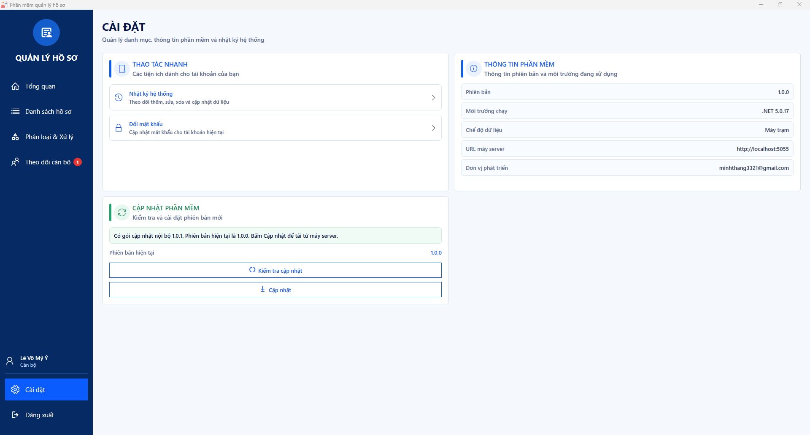

1. Bấm **Kiểm tra cập nhật**.
2. Nếu có phiên bản mới, đọc số phiên bản và thông báo.
3. Bấm **Cập nhật** để tải gói từ máy chủ.
4. Lưu công việc trước khi cài đặt hoặc khởi động lại ứng dụng.

### 11.5 Quản lý danh mục - chỉ Admin

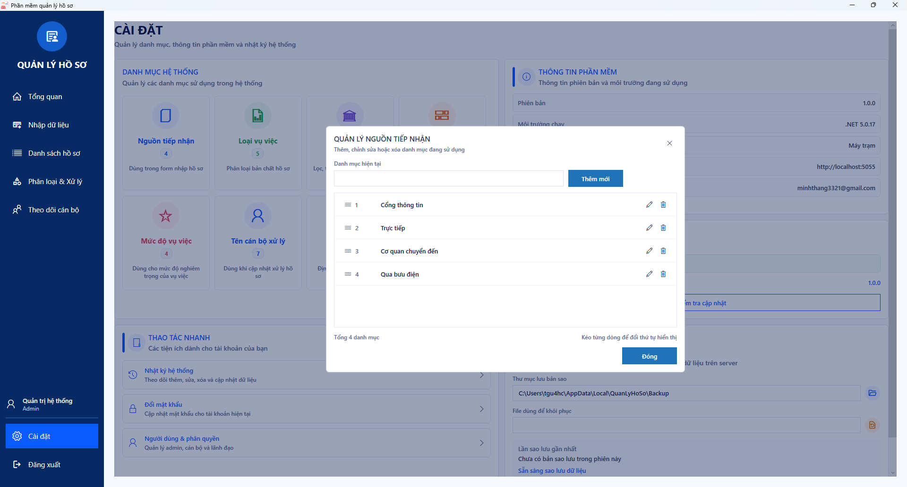

Admin có thể quản lý các danh mục:

- Nguồn tiếp nhận.
- Loại vụ việc.
- Lĩnh vực.
- Nhóm nội dung.
- Mức độ vụ việc.
- Tên cán bộ xử lý.
- Hướng xử lý.

Thao tác:

1. Chọn thẻ danh mục.
2. Nhập tên mới và bấm **Thêm mới**.
3. Bấm biểu tượng bút chì để sửa.
4. Bấm biểu tượng thùng rác để ngừng sử dụng/xóa mục theo quy tắc hệ thống.
5. Kéo từng dòng để đổi thứ tự hiển thị.
6. Bấm **Đóng** khi hoàn tất.

> Không tạo hai giá trị khác nhau chỉ bởi khoảng trắng hoặc cách viết hoa. Tránh xóa danh mục đang được dùng trong hồ sơ cũ.

### 11.6 Người dùng và phân quyền - chỉ Admin

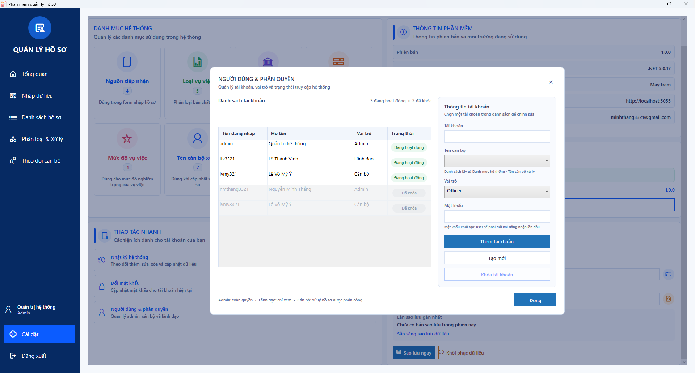

#### Tạo tài khoản

1. Bấm **Người dùng & phân quyền**.
2. Bấm **Tạo mới** để làm trống biểu mẫu.
3. Nhập **Tài khoản**.
4. Chọn **Tên cán bộ** từ danh mục có sẵn.
5. Chọn **Vai trò**.
6. Nhập mật khẩu khởi tạo.
7. Bấm **Thêm tài khoản**.

Người dùng phải đổi mật khẩu khi đăng nhập lần đầu.

#### Sửa hoặc khóa tài khoản

1. Chọn tài khoản trong danh sách.
2. Điều chỉnh tên cán bộ, vai trò hoặc nhập mật khẩu mới nếu cần cấp lại.
3. Lưu thay đổi hoặc bấm **Khóa tài khoản**.
4. Chọn tài khoản đã khóa để mở khóa khi cần.

Quy tắc:

- Không được trùng tên đăng nhập.
- Không được trùng tên cán bộ giữa các tài khoản, kể cả tài khoản đang khóa.
- Không thể khóa chính tài khoản đang đăng nhập.
- Hệ thống luôn phải còn ít nhất một Admin hoạt động.

### 11.7 Nhật ký toàn hệ thống - chỉ Admin

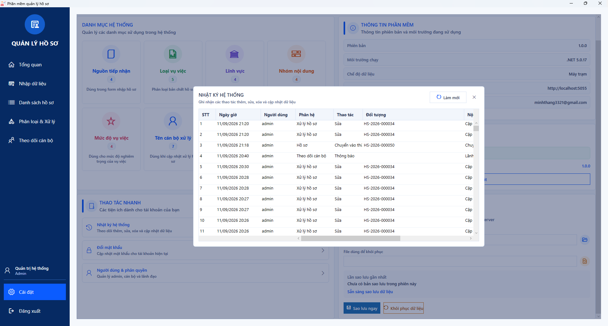

Admin dùng nhật ký để truy vết các thao tác thêm, sửa, xóa, cập nhật xử lý, quản lý người dùng và dữ liệu. Có thể bấm **Làm mới** để xem các sự kiện mới nhất.

### 11.8 Sao lưu và khôi phục - chỉ Admin

Khối sao lưu nằm trên trang Cài đặt của Admin.

#### Sao lưu

1. Chọn thư mục lưu bản sao trên máy đang sử dụng.
2. Bấm **Sao lưu ngay**.
3. Chờ máy chủ tạo bản sao an toàn và tải file `.db` về thư mục đã chọn.
4. Kiểm tra trạng thái và thời điểm sao lưu gần nhất.

#### Khôi phục

1. Chọn đúng file cơ sở dữ liệu `.db`.
2. Bấm **Khôi phục dữ liệu**.
3. Đọc kỹ cảnh báo và xác nhận.
4. Chờ kiểm tra dữ liệu và khôi phục hoàn tất.
5. Mở lại các trang quan trọng để kiểm tra số liệu.

> Khôi phục sẽ thay đổi dữ liệu dùng chung của toàn bộ người dùng. Chỉ thực hiện khi đã thông báo người đang sử dụng hệ thống và đã tạo bản sao hiện trạng.

---

## 12. Hướng dẫn theo từng vai trò

### 12.1 Quy trình làm việc gợi ý cho Admin

1. Kiểm tra máy chủ và đăng nhập.
2. Kiểm tra Tổng quan.
3. Tiếp nhận hồ sơ tại **Nhập dữ liệu**.
4. Rà soát tại **Danh sách hồ sơ**.
5. Phân loại, phân công hoặc cập nhật hồ sơ tại **Phân loại & Xử lý**.
6. Theo dõi tiến độ cán bộ.
7. Quản lý danh mục/người dùng khi cần.
8. Kiểm tra nhật ký và sao lưu định kỳ.

### 12.2 Quy trình làm việc gợi ý cho Lãnh đạo

1. Xem số liệu tại Tổng quan.
2. Tra cứu và xem chi tiết hồ sơ.
3. Kiểm tra hàng chờ và tiến độ xử lý.
4. Theo dõi tỷ lệ đúng hạn, deadline và KPI từng cán bộ.
5. Gửi thông báo, nhắc nhở hoặc đặt KPI.
6. Kiểm tra thông báo Admin gửi đến.

### 12.3 Quy trình làm việc gợi ý cho Cán bộ

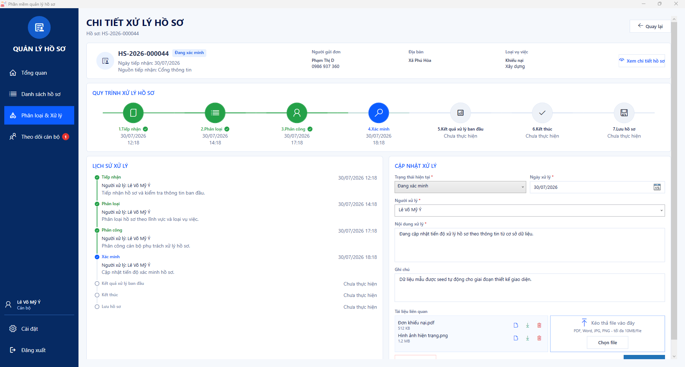

1. Kiểm tra huy hiệu thông báo sau khi đăng nhập.
2. Mở **Phân loại & Xử lý** để xem việc được giao.
3. Ưu tiên hồ sơ quá hạn, sắp đến hạn hoặc mức độ cao.
4. Mở **Chi tiết xử lý**, nhập nội dung và tài liệu chứng minh.
5. Bấm **Cập nhật** và kiểm tra lịch sử vừa ghi.
6. Theo dõi KPI và thông báo cá nhân.

---

## 13. Xử lý sự cố thường gặp

### 13.1 Không đăng nhập được

- Kiểm tra tên đăng nhập và mật khẩu.
- Kiểm tra Caps Lock và kiểu gõ bàn phím.
- Kiểm tra máy chủ có ở trạng thái **Đang hoạt động**.
- Kiểm tra URL máy chủ trong trang Cài đặt.
- Liên hệ Admin nếu tài khoản bị khóa hoặc quên mật khẩu.

### 13.2 Bị yêu cầu đổi mật khẩu ngay sau đăng nhập

Đây là hành vi bình thường với tài khoản mới hoặc vừa được cấp lại mật khẩu. Nhập mật khẩu tạm làm mật khẩu hiện tại rồi đặt mật khẩu mới.

### 13.3 Không thấy hồ sơ

- Xóa bộ lọc bằng nút **Đặt lại**.
- Kiểm tra khoảng ngày.
- Kiểm tra trạng thái, địa bàn và người xử lý.
- Với Cán bộ, xác nhận hồ sơ đã được phân công đúng tên cán bộ của tài khoản.
- Kiểm tra hồ sơ có nằm trong thùng rác hay không.

### 13.4 Không thể sửa hoặc cập nhật hồ sơ

- Lãnh đạo chỉ có quyền xem.
- Cán bộ chỉ sửa hồ sơ mình phụ trách.
- Hồ sơ trong thùng rác không thể cập nhật.
- Kiểm tra bước quy trình có cho phép trạng thái muốn chọn hay không.

### 13.5 Tài liệu có tên nhưng không mở được

- File gốc có thể đã bị di chuyển, đổi tên hoặc xóa.
- Đường dẫn file có thể nằm trên một máy khác.
- Kiểm tra kết nối đến vị trí lưu file.
- Thử tải tài liệu về máy nếu nút tải khả dụng.
- Nếu file cũ không còn đường dẫn hợp lệ, liên hệ người đã đính kèm hoặc Admin để bổ sung lại.

### 13.6 Không thấy thông báo mới ngay lập tức

- Chờ tối đa vài giây để hệ thống cập nhật huy hiệu nền.
- Mở trang **Theo dõi cán bộ** và kiểm tra danh sách.
- Kiểm tra kết nối máy chủ.
- Đăng xuất và đăng nhập lại nếu kết nối đã bị gián đoạn lâu.

### 13.7 Không xuất được Excel hoặc cập nhật phần mềm

- Kiểm tra quyền ghi vào thư mục đích.
- Đóng file Excel trùng tên đang mở.
- Kiểm tra dung lượng ổ đĩa.
- Kiểm tra kết nối máy chủ trước khi tải bản cập nhật.

---

## 14. Nguyên tắc an toàn dữ liệu

- Không chia sẻ tài khoản hoặc mật khẩu.
- Đăng xuất khi rời máy dùng chung.
- Không gửi ảnh chụp chứa dữ liệu thật lên kênh công khai.
- Kiểm tra mã hồ sơ trước khi sửa, xóa, khôi phục hoặc cập nhật quy trình.
- Không xóa vĩnh viễn nếu chưa có bản sao lưu phù hợp.
- Sao lưu định kỳ và lưu ít nhất một bản ở vị trí an toàn.
- Không tự ý di chuyển file đính kèm sau khi đã liên kết với hồ sơ.
- Khi khôi phục cơ sở dữ liệu, thông báo cho người dùng và dừng thao tác phát sinh dữ liệu mới.
- Báo Admin khi phát hiện sai quyền, dữ liệu bất thường hoặc thao tác không được ghi vào nhật ký.

---

## Thông tin hỗ trợ cần cung cấp khi báo lỗi

Để việc kiểm tra nhanh hơn, người dùng nên cung cấp:

- Tên tài khoản và vai trò; không cung cấp mật khẩu.
- Tên máy và thời điểm xảy ra lỗi.
- Trang/chức năng đang sử dụng.
- Mã hồ sơ liên quan.
- Nội dung thông báo lỗi.
- Ảnh chụp màn hình đã che thông tin nhạy cảm.
- Các bước đã thực hiện trước khi lỗi xuất hiện.
