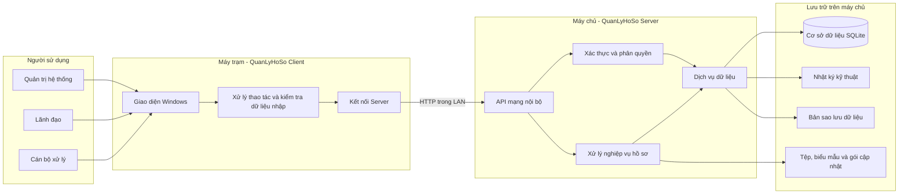
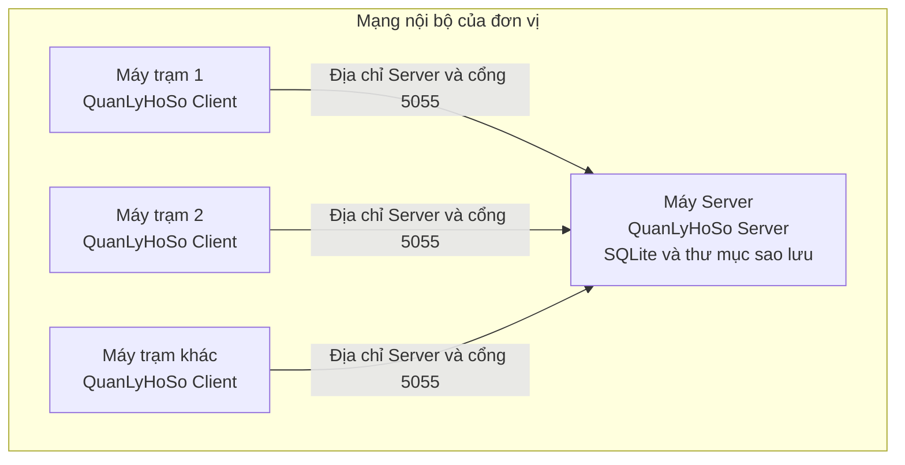
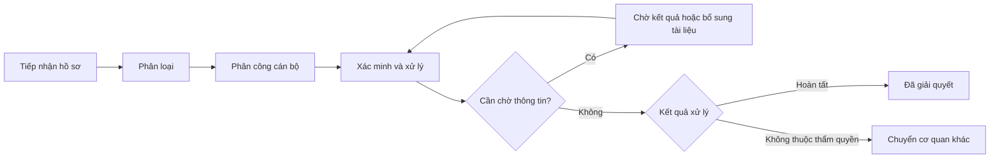
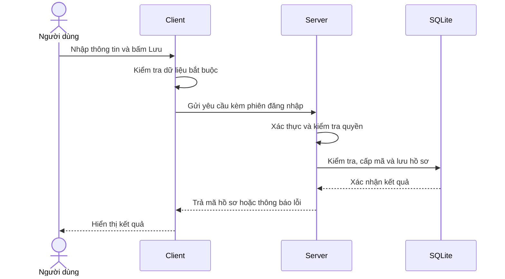

# TÀI LIỆU THIẾT KẾ TỔNG THỂ HỆ THỐNG QUẢN LÝ HỒ SƠ

| Thông tin | Giá trị |
|---|---|
| Mức tài liệu | Thiết kế tổng thể (High Level Design) |
| Đối tượng đọc | Khách hàng, cán bộ quản lý và đơn vị triển khai |
| Ngày cập nhật | 17/09/2026 |

## 1. Mục đích tài liệu

Tài liệu này trình bày thiết kế hệ thống **Quản lý hồ sơ** ở mức tổng thể, dành cho khách hàng, cán bộ quản lý, cán bộ vận hành và đơn vị triển khai.

Nội dung tập trung trả lời các câu hỏi:

- Hệ thống gồm những thành phần nào?
- Dữ liệu được lưu ở đâu và các máy trạm kết nối như thế nào?
- Người dùng theo từng vai trò được phép làm gì?
- Hồ sơ đi qua những bước xử lý nào?
- Hệ thống bảo vệ, sao lưu và khôi phục dữ liệu ra sao?
- Những giới hạn nào cần lưu ý khi vận hành?

Các chi tiết dành cho đội phát triển như tên class, cấu trúc source code và câu lệnh cơ sở dữ liệu không thuộc phạm vi tài liệu này.

## 2. Tổng quan giải pháp

Hệ thống được xây dựng theo mô hình **Client–Server trong mạng nội bộ (LAN)**:

- **QuanLyHoSo Server** được cài trên một máy chủ hoặc máy tính được chọn làm máy chủ. Thành phần này quản lý dữ liệu tập trung, xác thực tài khoản, xử lý nghiệp vụ, sao lưu và cung cấp dữ liệu cho các máy trạm.
- **QuanLyHoSo Client** được cài trên máy của người dùng. Người dùng đăng nhập, nhập hồ sơ, theo dõi tiến độ và thực hiện các chức năng theo quyền được cấp.
- **Cơ sở dữ liệu SQLite** nằm trên máy Server. Máy Client không mở hoặc chỉnh sửa trực tiếp file cơ sở dữ liệu.
- Việc trao đổi dữ liệu diễn ra qua API nội bộ bằng giao thức HTTP trong mạng LAN.

Giải pháp phù hợp với đơn vị cần quản lý dữ liệu tập trung trong nội bộ, không phụ thuộc dịch vụ đám mây và vẫn có thể vận hành khi mạng Internet bên ngoài bị gián đoạn.

## 3. Sơ đồ thành phần hệ thống

GitHub hỗ trợ hiển thị trực tiếp sơ đồ Mermaid dưới đây.

### Ý nghĩa các khối

| Thành phần | Vai trò chính |
|---|---|
| Client | Hiển thị giao diện và gửi yêu cầu của người dùng tới Server. |
| Server | Xác thực, kiểm tra quyền, áp dụng quy tắc nghiệp vụ và quản lý dữ liệu tập trung. |
| SQLite | Lưu tài khoản, hồ sơ, danh mục, lịch sử xử lý, thông báo và nhật ký hệ thống. |
| Khu vực tệp | Lưu tài liệu liên quan, biểu mẫu Word, gói cập nhật và các tệp phục vụ vận hành. |
| Sao lưu | Lưu các bản sao cơ sở dữ liệu để phục hồi khi có sự cố. |

## 4. Sơ đồ triển khai

Điều kiện vận hành:

- Máy Server phải được bật và ứng dụng Server phải đang chạy để các máy Client làm việc.
- Các máy phải nhìn thấy nhau trong cùng mạng nội bộ hoặc qua kết nối mạng được đơn vị cho phép.
- Tường lửa phải cho phép kết nối tới địa chỉ và cổng cấu hình của Server.
- Không nên đổi tên máy, địa chỉ IP hoặc vị trí dữ liệu của Server mà chưa cập nhật cấu hình Client.
- Nên dùng địa chỉ IP tĩnh hoặc tên máy ổn định cho Server.

## 5. Vai trò và phân quyền

Hệ thống có ba vai trò chính:

| Chức năng | Admin | Lãnh đạo | Cán bộ |
|---|:---:|:---:|:---:|
| Xem tổng quan | Toàn hệ thống | Toàn hệ thống | Chỉ dữ liệu/hồ sơ của chính cán bộ |
| Nhập hồ sơ mới | Có | Không | Không |
| Xem danh sách hồ sơ | Toàn hệ thống | Toàn hệ thống, chủ yếu chỉ xem | Hồ sơ thuộc phạm vi được giao |
| Phân loại và cập nhật xử lý | Có | Chỉ xem | Hồ sơ được phân công |
| Theo dõi cán bộ | Có | Có | Phạm vi cá nhân |
| Quản lý danh mục | Có | Không | Không |
| Quản lý tài khoản | Có | Không | Không |
| Sao lưu và khôi phục | Có | Không | Không |

Server kiểm tra lại quyền ở mỗi yêu cầu. Việc ẩn nút trên giao diện chỉ giúp dễ sử dụng, không phải lớp bảo vệ duy nhất.

## 6. Các phân hệ nghiệp vụ

### 6.1 Tổng quan

Cung cấp cái nhìn nhanh về tình trạng hồ sơ:

- Tổng số hồ sơ.
- Hồ sơ đang xử lý.
- Hồ sơ đã giải quyết.
- Hồ sơ đang chờ kết quả.
- Phân bố hồ sơ theo trạng thái và địa bàn.
- Các hồ sơ được cập nhật gần đây.

Các số liệu được lấy từ dữ liệu tập trung trên Server và tuân theo phạm vi xem của tài khoản đang đăng nhập. Admin và Lãnh đạo xem số liệu toàn hệ thống; Cán bộ chỉ xem số liệu tổng quan được tính từ hồ sơ do chính mình phụ trách, không xem tổng hợp của cán bộ khác.

### 6.2 Nhập dữ liệu

Cho phép tiếp nhận hồ sơ mới với các nhóm thông tin:

- Thông tin tiếp nhận và người gửi.
- Địa bàn, địa chỉ xảy ra vụ việc và nội dung.
- Loại vụ việc, lĩnh vực, nhóm nội dung và hướng xử lý dự kiến.
- Mức độ vụ việc và ngày hẹn trả kết quả.
- Tài liệu liên quan.

Hệ thống kiểm tra các trường bắt buộc, cấp mã hồ sơ và ghi nhận người tạo. Khi phát hiện lịch sử của cùng người gửi, người dùng có thể đối chiếu trước khi quyết định tạo hồ sơ độc lập hoặc ghi nhận hồ sơ gửi lại.

### 6.3 Danh sách hồ sơ

Cho phép:

- Tìm kiếm, lọc và sắp xếp hồ sơ.
- Xem chi tiết và lịch sử xử lý.
- Sửa hồ sơ theo quyền.
- Chọn nhiều hồ sơ để thực hiện thao tác phù hợp.
- Đưa hồ sơ vào thùng rác và khôi phục theo quyền.
- Xuất dữ liệu phục vụ tổng hợp, báo cáo.

### 6.4 Phân loại và xử lý

Hỗ trợ cán bộ tiếp nhận công việc, cập nhật quá trình xác minh, ghi chú kết quả và hoàn tất hồ sơ. Hệ thống lưu lại lịch sử của từng lần cập nhật để phục vụ tra cứu.

Các thẻ thống kê giúp nhận biết nhanh:

- Hồ sơ cần phân loại.
- Hồ sơ đang xử lý.
- Hồ sơ đang chờ kết quả.
- Hồ sơ sắp đến hạn hoặc quá hạn.
- Hồ sơ có mức độ cao.

Ba giá trị `Nghiêm trọng`, `Rất nghiêm trọng` và `Đặc biệt nghiêm trọng` được dùng để tính thẻ mức độ cao. Vì vậy, danh mục mức độ vụ việc là dữ liệu chuẩn do hệ thống quản lý và không hiển thị trong phần danh mục cho phép chỉnh sửa.

### 6.5 Theo dõi cán bộ

Giúp Admin và Lãnh đạo theo dõi:

- Số hồ sơ đang phụ trách của từng cán bộ.
- Số hồ sơ đã hoàn thành.
- Hồ sơ sắp đến hạn và quá hạn.
- Tỷ lệ xử lý đúng hạn.
- Cảnh báo và thông báo liên quan.

Tên cán bộ được lấy từ dữ liệu tài khoản, danh mục cán bộ và hồ sơ thực tế; hệ thống không tính toán dựa trên tên một cá nhân được viết cứng trong chương trình.

### 6.6 Cài đặt và quản trị

Admin có thể:

- Quản lý các danh mục nghiệp vụ được phép thay đổi.
- Tạo, sửa, khóa hoặc mở khóa tài khoản.
- Xem nhật ký thao tác toàn hệ thống.
- Sao lưu và khôi phục dữ liệu.
- Kiểm tra thông tin phiên bản và gói cập nhật.

Các vai trò khác có thể xem thông tin phần mềm, đổi mật khẩu, kiểm tra cập nhật và xem nhật ký thuộc phạm vi của mình.

## 7. Vòng đời hồ sơ

Quy trình thực tế có thể thay đổi theo nội dung xử lý, nhưng luồng tổng thể như sau:

Tại mỗi bước, hệ thống có thể ghi nhận thời gian, cán bộ thực hiện, nội dung xử lý và trạng thái mới. Lịch sử đã ghi giúp đơn vị truy vết quá trình giải quyết hồ sơ.

## 8. Luồng trao đổi dữ liệu

Ví dụ khi người dùng lưu một hồ sơ:

Nguyên tắc quan trọng:

- Server là nơi quyết định cuối cùng việc một thao tác có hợp lệ hay không.
- Client không ghi trực tiếp vào file SQLite.
- Dữ liệu gửi từ Client được kiểm tra lại tại Server.
- Khi hai máy cùng làm việc, dữ liệu mới được lưu tập trung ngay trên Server.
- Hệ thống hiện không dùng cơ chế đẩy thời gian thực tới mọi màn hình đang mở. Một số màn hình tải lại khi truy cập hoặc quay lại trang; người dùng cần mở lại trang liên quan khi muốn lấy trạng thái mới nhất từ máy khác.

## 9. Thiết kế dữ liệu ở mức tổng thể

Dữ liệu chính gồm:

| Nhóm dữ liệu | Nội dung |
|---|---|
| Người dùng | Tài khoản, họ tên, vai trò, trạng thái và yêu cầu đổi mật khẩu. |
| Hồ sơ | Thông tin tiếp nhận, người gửi, nội dung, phân loại, mức độ, hạn xử lý và trạng thái. |
| Lịch sử xử lý | Các bước đã thực hiện, thời gian, cán bộ và nội dung cập nhật. |
| Tài liệu liên quan | Thông tin tệp gắn với hồ sơ. |
| Danh mục | Nguồn tiếp nhận, loại vụ việc, lĩnh vực, nhóm nội dung, cán bộ và hướng xử lý. |
| Địa bàn | Danh sách địa bàn và đơn vị phục vụ lọc, nhập liệu và thống kê. |
| Nhật ký hệ thống | Hoạt động quan trọng phục vụ kiểm tra và truy vết. |
| Thông báo/KPI | Cảnh báo, chỉ tiêu và dữ liệu theo dõi dành cho lãnh đạo. |

Khi cài mới cho khách hàng:

- Hệ thống tạo tài khoản quản trị mặc định và yêu cầu quản lý lại mật khẩu.
- Các địa bàn và danh mục chuẩn được khởi tạo sẵn.
- Không tạo hồ sơ mẫu trong cơ sở dữ liệu vận hành.
- Dữ liệu mẫu chỉ được tạo khi chạy chế độ demo riêng.

## 10. An toàn và bảo mật

Các cơ chế chính:

- Mật khẩu được băm kèm giá trị ngẫu nhiên; hệ thống không lưu mật khẩu ở dạng đọc được.
- Sau khi đăng nhập, Client sử dụng phiên làm việc do Server cấp.
- Server xác định lại người dùng và vai trò từ cơ sở dữ liệu ở mỗi yêu cầu quan trọng.
- Tài khoản có thể bị khóa; hệ thống luôn bảo đảm còn ít nhất một Admin hoạt động.
- Người dùng mới có thể được yêu cầu đổi mật khẩu trong lần đăng nhập đầu tiên.
- Các thao tác quan trọng được ghi nhật ký để truy vết.

Giới hạn hiện tại:

- Kết nối Client–Server sử dụng HTTP trong mạng nội bộ, chưa mã hóa bằng HTTPS/TLS.
- Hệ thống chỉ nên được triển khai trong mạng LAN tin cậy, có kiểm soát người và thiết bị truy cập.
- Không nên mở trực tiếp cổng Server ra Internet.

## 11. Sao lưu và khôi phục

### Sao lưu tự động

- Server kiểm tra sao lưu khi khởi động và định kỳ trong lúc hoạt động.
- Khi bản tự động gần nhất đã đủ 7 ngày, hệ thống tạo một bản mới.
- Thư mục sao lưu giữ 10 bản gần nhất theo chính sách hiện tại.

### Sao lưu thủ công

Admin có thể yêu cầu Server tạo một bản sao an toàn và lưu/tải bản sao về vị trí đã chọn.

### Khôi phục

Trước khi thay dữ liệu hiện tại, hệ thống:

1. Kiểm tra file được chọn.
2. Tạo bản sao an toàn của dữ liệu đang dùng.
3. Khôi phục cơ sở dữ liệu.
4. Kiểm tra nhanh tính toàn vẹn.
5. Xóa tệp tải lên tạm thời sau khi hoàn tất.

Khôi phục ảnh hưởng tới toàn bộ người dùng. Admin cần thông báo dừng thao tác phát sinh dữ liệu trước khi thực hiện.

## 12. Nhật ký và khả năng truy vết

Hệ thống sử dụng hai nhóm nhật ký:

- **Nhật ký nghiệp vụ:** lưu các hoạt động quan trọng để Admin tra cứu trong phần Cài đặt.
- **Nhật ký kỹ thuật:** lưu lỗi và thông tin vận hành trên máy Server để hỗ trợ chẩn đoán sự cố.

Nhật ký giúp trả lời các câu hỏi như: ai đã thao tác, thao tác lúc nào, trên hồ sơ hoặc đối tượng nào và kết quả ra sao.

## 13. Cập nhật phần mềm

Hệ thống hỗ trợ kiểm tra gói cập nhật nội bộ. Khi nâng cấp:

- Client và Server bắt buộc sử dụng cùng phiên bản phát hành.
- Client gửi phiên bản trong mỗi kết nối; Server công bố phiên bản yêu cầu qua kiểm tra trạng thái.
- Server từ chối đăng nhập và thao tác nghiệp vụ khi Client thiếu phiên bản hoặc có phiên bản khác, đồng thời Client hiển thị yêu cầu cập nhật.
- Cần sao lưu dữ liệu trước khi nâng cấp.
- Nên dừng thao tác nhập liệu trong thời gian cập nhật Server.
- Cập nhật Server trước, sau đó cập nhật toàn bộ Client ngay trong cùng đợt bảo trì.
- Cơ sở dữ liệu hiện có được giữ lại; quá trình cập nhật không tự tạo lại dữ liệu mẫu.

## 14. Khả năng hoạt động và xử lý sự cố

| Tình huống | Ảnh hưởng | Hướng xử lý |
|---|---|---|
| Server tắt | Client không đăng nhập hoặc tải dữ liệu được. | Khởi động máy và ứng dụng Server. |
| Mất mạng LAN | Máy bị mất kết nối không thể lưu dữ liệu mới. | Khôi phục mạng rồi thực hiện lại thao tác. |
| Sai URL Server | Client báo không kết nối được. | Kiểm tra cấu hình địa chỉ và cổng. |
| Client và Server khác phiên bản | Client không được đăng nhập hoặc thực hiện thao tác nghiệp vụ. | Cài Client có cùng phiên bản đang chạy trên Server. |
| Database bị khóa hoặc lỗi | Một số thao tác dữ liệu thất bại. | Dừng thao tác, kiểm tra nhật ký và dùng bản sao lưu khi cần. |
| Cập nhật từ máy khác | Màn hình đang mở có thể chưa hiển thị ngay. | Mở lại trang hoặc thực hiện thao tác tải lại theo màn hình. |

## 15. Phạm vi và giới hạn hiện tại

Hệ thống hiện được thiết kế cho:

- Ứng dụng Windows Desktop.
- Một Server dữ liệu trung tâm trong mạng LAN.
- Nhiều Client cùng kết nối đến Server.
- Quản lý hồ sơ, lịch sử xử lý, danh mục, người dùng, thống kê và sao lưu.

Chưa bao gồm:

- Ứng dụng Web hoặc Mobile.
- Đồng bộ nhiều Server hoặc mô hình dự phòng tự động.
- Đăng nhập một lần với hệ thống danh tính bên ngoài.
- Chữ ký số, SMS, email hoặc tích hợp cổng dịch vụ khác.
- HTTPS/TLS tích hợp sẵn cho kết nối Client–Server.
- Cơ chế thông báo đẩy thời gian thực tới mọi màn hình đang mở.
- Kho quản lý tài liệu chuyên dụng thay thế hoàn toàn hệ thống tệp.

Đối với tệp đính kèm, phiên bản hiện tại trao đổi thông tin tệp và đường dẫn qua API nhưng chưa thực hiện tải nội dung tệp vật lý từ Client lên Server. Đơn vị triển khai cần thống nhất thư mục dùng chung hoặc quy trình lưu tệp phù hợp cho tới khi chức năng tải tệp tập trung được bổ sung.

Các nội dung trên có thể được phát triển ở giai đoạn sau tùy nhu cầu và hạ tầng của đơn vị.

## 16. Nguyên tắc vận hành khuyến nghị

- Bố trí máy Server ổn định, hạn chế tắt đột ngột.
- Chỉ người phụ trách được cấp quyền truy cập máy Server và thư mục dữ liệu.
- Thay mật khẩu Admin mặc định ngay sau khi bàn giao.
- Kiểm tra bản sao lưu định kỳ và lưu thêm ít nhất một bản ở thiết bị/vị trí an toàn.
- Không gửi file cơ sở dữ liệu hoặc bản sao lưu qua kênh công cộng không được bảo vệ.
- Không chỉnh sửa trực tiếp cơ sở dữ liệu bằng công cụ bên ngoài.
- Khi có lỗi, ghi nhận thời điểm, tài khoản, mã hồ sơ và ảnh màn hình để hỗ trợ kiểm tra nhật ký.
- Thử nghiệm gói cập nhật và quy trình khôi phục trước khi áp dụng trên dữ liệu chính thức.

## 17. Tài liệu liên quan

- [Hướng dẫn cài đặt Server và Client](Huong_dan_cai_dat_Server_Client.md)
- [Hướng dẫn sử dụng phần mềm](Huong_dan_su_dung_QuanLyHoSo.md)
- [README của dự án](../README.md)

---

Tài liệu này mô tả kiến trúc đang được áp dụng ở mức tổng thể. Khi thay đổi mô hình triển khai, phân quyền, quy trình nghiệp vụ hoặc chính sách sao lưu, tài liệu cần được cập nhật đồng thời.
